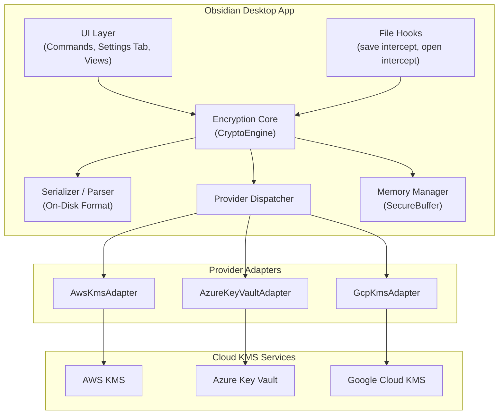
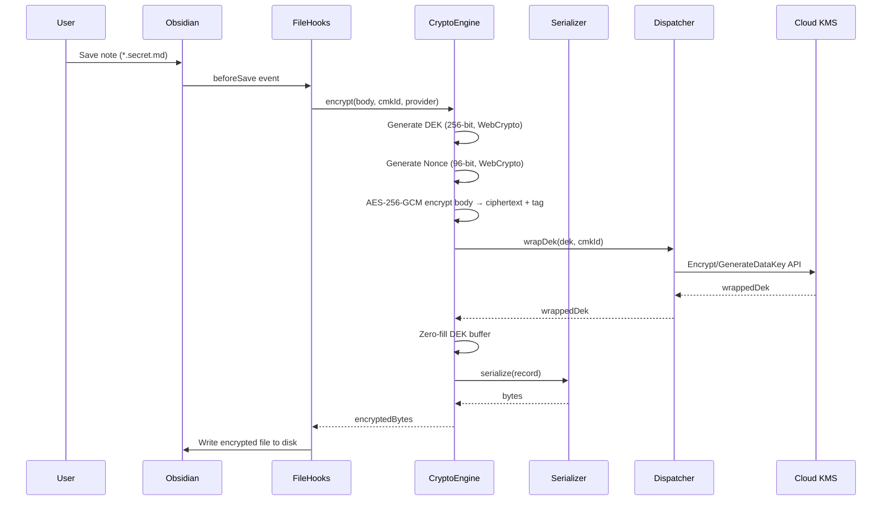
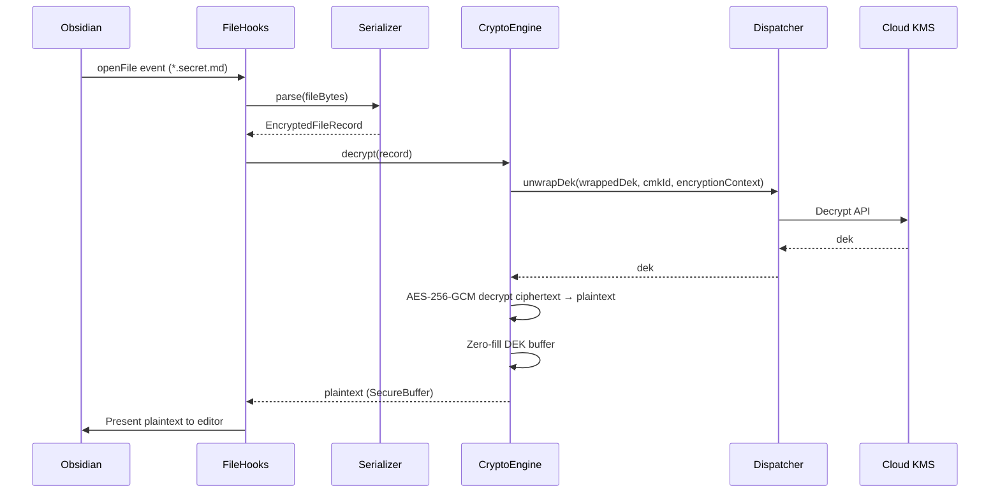

# Design Document — obsidian-cloud-kms-encryption

## Overview

This document describes the technical design for the `obsidian-cloud-kms-encryption` Obsidian plugin. The plugin provides file-level envelope encryption of vault content (Markdown notes and binary attachments) using Cloud KMS services (AWS KMS, Azure Key Vault, Google Cloud KMS) as the root of trust for Customer Master Keys (CMKs).

**Core Principle:** Envelope Encryption — a locally generated AES-256-GCM Data Encryption Key (DEK) encrypts the payload; the DEK itself is wrapped by a CMK held in Cloud KMS. Symmetric crypto runs locally via WebCrypto; only DEK wrap/unwrap calls traverse the network.

**Delivery Phases:**
- Phase 1 (PoC): Manual encrypt/decrypt commands, single AWS KMS CMK
- Phase 2 (MVP): Transparent file encryption on save/open, attachment preview, on-disk format versioning
- Phase 3 (Advanced): Multi-provider KMS (AWS, Azure, GCP), per-folder Encrypted Vault Policies, key rotation

## Architecture

### High-Level Component Diagram



### Data Flow (Encrypt on Save)



### Data Flow (Decrypt on Open)



## Components and Interfaces

### Provider Adapter Interface

```typescript
/**
 * Encryption context passed to KMS for audit trail binding.
 * Must be identical for wrap and unwrap of the same DEK.
 */
export interface EncryptionContext {
  vaultName: string;
  filePath: string;        // Vault-relative path
  formatVersion: number;
}

/**
 * Result of a DEK generation + wrap operation.
 */
export interface GenerateDataKeyResult {
  /** Plaintext DEK bytes (256-bit / 32 bytes). Caller MUST zero after use. */
  plaintextDek: Uint8Array;
  /** DEK encrypted by the CMK. Safe to persist. */
  wrappedDek: Uint8Array;
}

/**
 * Provider Adapter interface — the single extension point for KMS providers.
 * Each adapter implements this interface for one cloud provider.
 */
export interface ProviderAdapter {
  /** Unique provider identifier: 1–32 lowercase ASCII alphanumeric + hyphens */
  readonly providerId: string;

  /**
   * Generate a fresh 256-bit DEK and return both plaintext and wrapped forms.
   * The KMS service generates or wraps the key server-side.
   * @param cmkId - Provider-specific CMK identifier (ARN, URI, resource name)
   * @param context - Encryption context for audit binding
   * @throws ProviderError on auth, network, or timeout failure
   */
  generateDataKey(
    cmkId: string,
    context: EncryptionContext
  ): Promise<GenerateDataKeyResult>;

  /**
   * Wrap (encrypt) an existing DEK with the specified CMK.
   * Used during key rotation to re-wrap under a new CMK.
   * @param dek - Plaintext DEK bytes (32 bytes)
   * @param cmkId - Target CMK identifier
   * @param context - Encryption context for audit binding
   * @throws ProviderError on auth, network, or timeout failure
   */
  wrapDek(
    dek: Uint8Array,
    cmkId: string,
    context: EncryptionContext
  ): Promise<Uint8Array>;

  /**
   * Unwrap (decrypt) a wrapped DEK using the specified CMK.
   * @param wrappedDek - Encrypted DEK bytes
   * @param cmkId - CMK identifier used for the original wrap
   * @param context - Encryption context (must match wrap-time context)
   * @throws ProviderError on auth, network, timeout, or integrity failure
   */
  unwrapDek(
    wrappedDek: Uint8Array,
    cmkId: string,
    context: EncryptionContext
  ): Promise<Uint8Array>;

  /**
   * Validate that credentials are available and the CMK is accessible.
   * Used for settings validation and health checks.
   * @param cmkId - CMK identifier to validate
   * @throws ProviderError if credentials or CMK are unavailable
   */
  validateAccess(cmkId: string): Promise<void>;
}
```

### CryptoEngine Interface

```typescript
export interface CryptoEngine {
  /**
   * Encrypt plaintext using envelope encryption.
   * Generates DEK + nonce locally, encrypts with AES-256-GCM,
   * wraps DEK via provider, returns serializable record.
   */
  encrypt(
    plaintext: Uint8Array,
    cmkId: string,
    providerId: string,
    context: EncryptionContext
  ): Promise<EncryptedFileRecord>;

  /**
   * Decrypt an EncryptedFileRecord back to plaintext.
   * Unwraps DEK via provider, decrypts with AES-256-GCM,
   * verifies authentication tag.
   */
  decrypt(
    record: EncryptedFileRecord,
    context: EncryptionContext
  ): Promise<Uint8Array>;
}
```

### Provider Dispatcher

```typescript
export interface ProviderDispatcher {
  /**
   * Register a provider adapter. Rejects duplicates.
   * @throws if providerId already registered or interface incomplete
   */
  register(adapter: ProviderAdapter): void;

  /**
   * Get adapter by provider identifier.
   * @throws ProviderNotFoundError if not registered
   */
  getAdapter(providerId: string): ProviderAdapter;

  /** List all registered provider identifiers */
  listProviders(): string[];
}
```

### SecureBuffer

```typescript
/**
 * Wrapper around Uint8Array that guarantees zero-fill on release.
 * Prevents plaintext from lingering in GC-managed memory.
 */
export interface SecureBuffer {
  readonly bytes: Uint8Array;
  readonly length: number;
  /** Zero-fill the buffer and mark as released. Further access throws. */
  release(): void;
  /** Whether the buffer has been released */
  readonly isReleased: boolean;
}
```

### EncryptedFileRecord

```typescript
export interface EncryptedFileRecord {
  magic: Uint8Array;          // 4 bytes: 0x4F 0x43 0x4B 0x45 ("OCKE")
  version: number;            // uint16, current = 1
  providerId: string;         // 1–32 chars ASCII
  cmkId: string;              // variable length, provider-specific
  wrappedDek: Uint8Array;     // variable length (provider-dependent, typically 256–512 bytes)
  nonce: Uint8Array;          // 12 bytes (96-bit)
  authTag: Uint8Array;        // 16 bytes (128-bit)
  ciphertext: Uint8Array;     // variable length
}
```

## Data Models

### On-Disk Format Specification (Version 1)

The on-disk format is a binary layout with length-prefixed fields. All multi-byte integers are stored in **big-endian** byte order.

```
Offset  Size        Field                Description
──────  ──────────  ───────────────────  ─────────────────────────────────────────
0       4 bytes     Magic                Fixed: 0x4F 0x43 0x4B 0x45 ("OCKE")
4       2 bytes     Version              uint16 BE, current value = 0x0001
6       1 byte      ProviderIdLen        Length of ProviderId (1–32)
7       N bytes     ProviderId           ASCII string (N = ProviderIdLen)
7+N     2 bytes     CmkIdLen             uint16 BE, length of CmkId (1–2048)
9+N     M bytes     CmkId                UTF-8 string (M = CmkIdLen)
9+N+M   2 bytes     WrappedDekLen        uint16 BE, length of WrappedDek (1–1024)
11+N+M  W bytes     WrappedDek           Raw bytes (W = WrappedDekLen)
11+N+M+W 12 bytes   Nonce                96-bit IV for AES-256-GCM
23+N+M+W 16 bytes   AuthTag              128-bit authentication tag
39+N+M+W 4 bytes    CiphertextLen        uint32 BE, length of Ciphertext
43+N+M+W C bytes    Ciphertext           AES-256-GCM encrypted payload
```

**Total file size:** 43 + N + M + W + C bytes (header overhead ≈ 43–3100 bytes depending on provider)

**Constraints:**
- Magic MUST be exactly `0x4F434B45`
- Version MUST be ≤ highest supported version (currently 1)
- ProviderIdLen MUST be in [1, 32]
- ProviderId MUST be ASCII lowercase alphanumeric + hyphens
- CmkIdLen MUST be in [1, 2048]
- WrappedDekLen MUST be in [1, 1024]
- Nonce is always exactly 12 bytes
- AuthTag is always exactly 16 bytes
- CiphertextLen MUST be in [0, 67,108,864] (0 to 64 MiB)
- No trailing bytes after Ciphertext

### Inline Encrypted Block Format (Phase 1 PoC)

For Phase 1 manual commands, encrypted blocks are embedded inline in Markdown using fenced markers:

```
```ocke-v1
<base64-encoded binary On-Disk Format>
```​
```

The parser detects the `ocke-v1` fence and base64-decodes the content before applying the binary parser.

### Settings Data Model

```typescript
interface PluginSettings {
  // Phase 1
  awsCmkArn: string;                    // AWS KMS Key ARN

  // Phase 2
  encryptedNoteSuffix: string;          // Default: ".secret.md"

  // Phase 3
  providers: ProviderConfig[];
  vaultPolicies: EncryptedVaultPolicy[];
}

interface ProviderConfig {
  providerId: string;                   // "aws-kms" | "azure-key-vault" | "gcp-kms"
  enabled: boolean;
  cmkId: string;                        // Provider-specific key identifier
}

interface EncryptedVaultPolicy {
  folderPath: string;                   // Vault-relative folder path
  providerId: string;
  cmkId: string;
}
```

### Encryption Context for Audit Binding

```typescript
// Passed to KMS wrap/unwrap for CloudTrail / audit log correlation
const encryptionContext: EncryptionContext = {
  vaultName: "my-vault",
  filePath: "clients/acme/notes/secret.secret.md",
  formatVersion: 1
};
```


## Correctness Properties

*A property is a characteristic or behavior that should hold true across all valid executions of a system — essentially, a formal statement about what the system should do. Properties serve as the bridge between human-readable specifications and machine-verifiable correctness guarantees.*

### Property 1: Serializer Round-Trip (serialize → parse)

*For any* valid `EncryptedFileRecord` whose fields satisfy all declared length and type constraints, serializing the record into the On-Disk Format and then parsing the resulting byte sequence SHALL yield a record whose every field is byte-for-byte equal to the original.

**Validates: Requirements 18.4**

### Property 2: Parser Round-Trip (parse → serialize)

*For any* byte sequence that is accepted by the parser as a valid On-Disk Format, parsing the bytes into an `EncryptedFileRecord` and then serializing that record SHALL yield a byte sequence of the same length and byte-for-byte equal to the input.

**Validates: Requirements 18.5**

### Property 3: Encrypt/Decrypt Round-Trip

*For any* plaintext byte sequence `P` with length in the range [0, 64 MiB], any registered Provider Adapter `A`, and any CMK `K` for which `A` grants wrap and unwrap access, `decrypt(A, K, encrypt(A, K, P))` SHALL equal `P` byte-for-byte.

**Validates: Requirements 19.1, 5.7, 6.2**

### Property 4: Encryption Freshness

*For any* plaintext byte sequence `P` and any CMK `K`, two sequential `encrypt(A, K, P)` invocations SHALL yield two Encrypted Files whose DEK bytes differ in at least one position AND whose Nonce bytes differ in at least one position.

**Validates: Requirements 19.2, 1.2, 1.4**

### Property 5: Tamper Detection

*For any* valid Encrypted File `E` produced by the serializer, if any single byte of `E.ciphertext`, `E.nonce`, `E.wrappedDek`, or `E.authTag` is modified, then `decrypt(E)` SHALL abort with an integrity error, SHALL NOT return any plaintext bytes, and SHALL NOT produce an on-disk side effect.

**Validates: Requirements 19.3**

### Property 6: Ciphertext Stability Under KMS Unavailability

*For any* Encrypted File on disk, when the Plugin cannot reach Cloud KMS (network error, authentication failure, or timeout), any user action (open, view folder, or attempted save) SHALL leave the file's on-disk bytes byte-for-byte unchanged.

**Validates: Requirements 20.1, 20.2, 20.3**

### Property 7: No Plaintext Leakage on Disk

*For any* plaintext byte sequence `P` of at least 32 bytes written through the Plugin's save path to a file covered by an Encrypted Vault Policy or the suffix rule, the resulting on-disk byte sequence SHALL NOT contain `P` as a contiguous substring, and SHALL NOT contain any 32-byte contiguous substring of `P` whose Shannon entropy exceeds 3 bits per byte.

**Validates: Requirements 21.1, 21.2, 12.1, 12.2**

### Property 8: No DEK Leakage on Disk

*For any* DEK byte sequence `D` generated by the Plugin, no file under the Vault directory, Obsidian's application data directory, or the operating system temporary directory SHALL contain `D` as a contiguous substring or any 16-byte contiguous substring of `D`.

**Validates: Requirements 21.4**

### Property 9: Confluence of Provider Adapter Dispatch

*For any* finite set of Provider Adapters `S` (size ≤ 64) and any permutation `S'` of `S`, initializing the Plugin with `S` versus `S'` SHALL yield the same success-or-failure classification and, on success, produce decrypted plaintext byte-for-byte equal across both registration orders for every encrypt and decrypt invocation over identical inputs.

**Validates: Requirements 22.1, 22.2**

### Property 10: Frontmatter Preservation

*For any* Markdown note containing a valid YAML frontmatter block (delimited by `---`) followed by a body, when the note is saved through the transparent encryption path, the resulting on-disk file SHALL contain the original frontmatter as plaintext (byte-for-byte equal) followed by an Encrypted File block representing the body.

**Validates: Requirements 5.3, 5.4, 5.5**

### Property 11: Policy Resolution Determinism

*For any* set of Encrypted Vault Policies and any file path within the vault:
- If the file is covered by exactly one policy, that policy's provider and CMK SHALL be used.
- If the file is covered by multiple policies, the policy with the longest folder-path prefix match SHALL be used.
- If the file is covered by both a policy and the suffix rule, the policy SHALL take precedence.

**Validates: Requirements 10.2, 10.3, 10.4**

### Property 12: Key Rotation Preserves Ciphertext

*For any* Encrypted File `E` and any target CMK `K'` for which the target provider grants wrap access, after a successful key rotation from the original CMK to `K'`, the resulting on-disk file SHALL have Ciphertext and Nonce bytes byte-for-byte identical to the original, with only the Wrapped DEK, provider identifier, and CMK identifier fields changed.

**Validates: Requirements 11.2**

### Property 13: ARN Validation Consistency

*For any* string `s`:
- If `s` is empty or composed entirely of whitespace, the encrypt and decrypt commands SHALL be disabled.
- If `s` does not match the pattern `arn:aws:kms:{region}:{12-digit-account}:key/{key-id}`, a validation error SHALL be displayed and commands SHALL remain disabled.
- If `s` matches the ARN pattern, no validation error SHALL be displayed and commands SHALL be enabled.

**Validates: Requirements 4.2, 4.3, 4.4**

## Error Handling

### Error Classification

| Category | Source | User Impact | Recovery |
|----------|--------|-------------|----------|
| `CredentialError` | AWS SDK chain, Azure AD, GCP ADC | Cannot encrypt/decrypt | Notice: configure credentials |
| `AuthorizationError` | KMS access denied | Cannot use specific CMK | Notice: check IAM policy |
| `NetworkError` | KMS unreachable, DNS failure | Cannot wrap/unwrap DEK | Notice: check connectivity |
| `TimeoutError` | KMS call > configured timeout | Operation aborted | Notice: retry later |
| `IntegrityError` | Auth tag mismatch, tampered data | Decryption refused | Notice: file may be corrupted |
| `FormatError` | Invalid magic, unsupported version, truncated header | Parse refused | Notice: upgrade plugin or check file |
| `ValidationError` | Invalid ARN, invalid suffix, duplicate policy | Config rejected | Inline error in settings |
| `CryptoError` | WebCrypto failure (rare) | Operation aborted | Notice: internal error |
| `SizeLimitError` | File > 50MB (attachments), selection > 1MiB | Operation refused | Notice: file too large |

### Error Handling Strategy

```typescript
/**
 * Base error class for all plugin errors.
 * Carries structured metadata for logging without leaking sensitive data.
 */
export class PluginError extends Error {
  constructor(
    message: string,
    public readonly category: ErrorCategory,
    public readonly providerId?: string,
    public readonly cmkId?: string,
    public readonly filePath?: string,
    public readonly cause?: Error
  ) {
    super(message);
    this.name = 'PluginError';
  }
}

export type ErrorCategory =
  | 'credential'
  | 'authorization'
  | 'network'
  | 'timeout'
  | 'integrity'
  | 'format'
  | 'validation'
  | 'crypto'
  | 'size-limit';
```

### Error Propagation Rules

1. **Never swallow errors silently** — every error surfaces as an Obsidian notice (≥5s) and a structured log entry.
2. **Never leak sensitive data in errors** — error messages contain category, file path, provider ID, but never plaintext, DEK, or credential material.
3. **Always leave disk unchanged on error** — if any step in encrypt/decrypt/rotate fails, the on-disk file remains byte-for-byte as before the operation started.
4. **Always zero DEK on error** — if an operation fails after DEK generation or unwrap, the DEK buffer is zeroed before the error propagates.
5. **Timeout enforcement** — all KMS calls use `AbortController` with configurable timeout (default 10s for normal ops, 30s for file encryption command).

### Atomic File Operations

For operations that modify files (transparent save, encrypt file command, key rotation):

```typescript
async function atomicFileWrite(
  vault: Vault,
  path: string,
  newContent: Uint8Array,
  originalContent: Uint8Array
): Promise<void> {
  const tempPath = `${path}.ocke-tmp`;
  try {
    await vault.adapter.writeBinary(tempPath, newContent);
    await vault.adapter.rename(tempPath, path);
  } catch (err) {
    // Rollback: remove temp file if it exists
    try { await vault.adapter.remove(tempPath); } catch {}
    throw new PluginError(
      `Atomic write failed for ${path}`,
      'crypto',
      undefined, undefined, path, err as Error
    );
  }
}
```

## Security Considerations

### Memory Management

1. **SecureBuffer implementation**: All plaintext and DEK material is held in `Uint8Array` instances wrapped by `SecureBuffer`. On release, the buffer is overwritten with zeros using `crypto.getRandomValues` fill pattern (to avoid compiler optimization removing the zero-fill).

2. **Lifecycle tracking**: A `BufferRegistry` tracks all active `SecureBuffer` instances. On plugin unload or app quit, all registered buffers are force-released.

3. **No string conversion for sensitive data**: Plaintext and DEK bytes are never converted to JavaScript strings (which are immutable and GC-managed). All crypto operations work directly on `Uint8Array`.

4. **Blob URL lifecycle**: Decrypted attachment Blob URLs are tracked per-view. When the last view referencing a Blob URL closes, `URL.revokeObjectURL()` is called and the backing buffer is released.

### Credential Handling

1. **No credential storage**: The plugin never stores, caches, or prompts for cloud credentials. All credential resolution is delegated to the respective cloud SDK's default provider chain.

2. **No DEK caching**: Unwrapped DEKs are never cached across operations. Each file open triggers a fresh KMS unwrap call, ensuring every access is recorded in the cloud audit log.

3. **Encryption context binding**: Every KMS wrap/unwrap call includes an encryption context (vault name, file path, format version). This binds the DEK to a specific file, preventing DEK reuse across files even if an attacker obtains a wrapped DEK.

### Threat Model Considerations

| Threat | Mitigation |
|--------|-----------|
| Disk compromise (stolen laptop, S3 breach) | Zero cleartext on disk; AES-256-GCM with per-file DEK |
| Memory dump / cold boot | SecureBuffer zero-fill on release; no string conversion |
| KMS credential theft | Delegated to cloud IAM; plugin holds no credentials |
| Tampered ciphertext | AES-256-GCM auth tag verification; any modification detected |
| Replay / DEK reuse | Fresh DEK + nonce per encryption; no DEK caching |
| Provider confusion | Provider ID in header; dispatch by explicit ID match |
| Downgrade attack | Magic bytes + version field; reject unknown versions |
| Supply chain attack | Pinned deps, lockfile integrity hashes, npm audit gate |

## Obsidian Integration Points

### Commands (Command Palette)

| Command | Phase | Condition |
|---------|-------|-----------|
| "Encrypt selection with AWS KMS" | 1 | Active Markdown editor + non-empty selection + valid ARN |
| "Decrypt selection with AWS KMS" | 1 | Active Markdown editor + non-empty selection |
| "Encrypt current file with AWS KMS" | 2 | Active file not already encrypted |
| "Rotate CMK for current file" | 3 | Active file is an Encrypted File |

### File Hooks

- **`vault.on('modify')` / `app.vault.on('raw')`**: Intercept save events for suffix-matching notes. Replace body with encrypted block before write completes.
- **File open hook**: Detect encrypted files on open, decrypt in memory, present plaintext to editor.
- **`registerFileExtension`**: Register `.enc.png`, `.enc.jpg`, `.enc.pdf` for custom handling.

### Settings Tab

```
┌─────────────────────────────────────────────────┐
│ Cloud KMS Encryption Settings                    │
├─────────────────────────────────────────────────┤
│ Phase 1 — AWS KMS                               │
│   AWS KMS Key ARN: [________________________]   │
│   ⚠ Invalid ARN format                          │
│                                                  │
│ Phase 2 — Transparent Encryption                 │
│   Encrypted note suffix: [.secret.md_______]    │
│                                                  │
│ Phase 3 — Providers                              │
│   ☑ AWS KMS    CMK: [arn:aws:kms:...]           │
│   ☐ Azure KV   Key: [________________________] │
│   ☐ GCP KMS    Key: [________________________] │
│                                                  │
│ Encrypted Vault Policies                         │
│   [+ Add Policy]                                 │
│   📁 clients/acme → aws-kms / arn:aws:...       │
│   📁 clients/beta → gcp-kms / projects/...      │
└─────────────────────────────────────────────────┘
```

### Custom Views

- **Encrypted File Read-Only View**: Shown when decryption fails. Displays raw on-disk content (hex dump or base64) with an error banner explaining the failure.
- **Attachment Error Placeholder**: Shown in place of encrypted attachments when decryption fails. Displays error icon + failure category.

## Module Structure / File Layout

```
src/
├── main.ts                          # Plugin entry point (onload/onunload)
├── types.ts                         # Shared TypeScript interfaces and types
├── constants.ts                     # Magic bytes, version, limits, defaults
│
├── core/
│   ├── crypto-engine.ts             # CryptoEngine: encrypt/decrypt orchestration
│   ├── secure-buffer.ts             # SecureBuffer implementation
│   ├── buffer-registry.ts           # Tracks active SecureBuffers for cleanup
│   └── webcrypto.ts                 # WebCrypto wrapper (AES-256-GCM)
│
├── format/
│   ├── serializer.ts                # On-Disk Format serializer
│   ├── parser.ts                    # On-Disk Format parser
│   ├── inline-codec.ts             # Base64 inline block encode/decode (Phase 1)
│   └── validators.ts                # Field constraint validators
│
├── providers/
│   ├── dispatcher.ts                # ProviderDispatcher: registry + routing
│   ├── adapter.ts                   # ProviderAdapter interface definition
│   ├── errors.ts                    # ProviderError types
│   ├── aws-kms-adapter.ts           # AWS KMS implementation
│   ├── azure-keyvault-adapter.ts    # Azure Key Vault implementation
│   └── gcp-kms-adapter.ts           # Google Cloud KMS implementation
│
├── hooks/
│   ├── save-hook.ts                 # Transparent encryption on save
│   ├── open-hook.ts                 # Transparent decryption on open
│   └── attachment-hook.ts           # Encrypted attachment preview
│
├── policies/
│   ├── policy-resolver.ts           # Encrypted Vault Policy resolution
│   └── suffix-matcher.ts            # Suffix-based file matching
│
├── commands/
│   ├── encrypt-selection.ts         # Phase 1: encrypt selection command
│   ├── decrypt-selection.ts         # Phase 1: decrypt selection command
│   ├── encrypt-file.ts              # Phase 2: encrypt current file command
│   └── rotate-cmk.ts               # Phase 3: key rotation command
│
├── ui/
│   ├── settings-tab.ts              # Plugin settings tab
│   ├── rotation-modal.ts            # Key rotation target selection dialog
│   ├── encrypted-view.ts            # Read-only view for failed decryption
│   └── notices.ts                   # Obsidian notice helpers
│
├── logging/
│   ├── structured-logger.ts         # Structured logging (info/error)
│   └── sanitizer.ts                 # Ensures no sensitive data in logs
│
└── utils/
    ├── atomic-write.ts              # Atomic file write with rollback
    ├── arn-validator.ts             # AWS ARN format validation
    └── frontmatter.ts              # Frontmatter detection and splitting
```

## Testing Strategy

### Testing Approach

The plugin uses a **dual testing approach**:
- **Unit tests** for specific examples, edge cases, error conditions, and integration points
- **Property-based tests (PBT)** for universal correctness properties across randomized inputs

### Test Framework

- **Test runner**: Vitest (fast, TypeScript-native, compatible with Obsidian plugin ecosystem)
- **PBT library**: [fast-check](https://github.com/dubzzz/fast-check) (mature, TypeScript-first, excellent shrinking)
- **Mocking**: Vitest built-in mocks for KMS adapters and Obsidian API

### Property-Based Tests

Each correctness property maps to a single `fast-check` property test with minimum **100 iterations**.

| Property | Test File | Generator Strategy |
|----------|-----------|-------------------|
| 1: Serializer round-trip | `format/serializer.property.test.ts` | Generate random valid `EncryptedFileRecord` with arbitrary field values within constraints |
| 2: Parser round-trip | `format/parser.property.test.ts` | Generate random valid on-disk format byte sequences |
| 3: Encrypt/Decrypt round-trip | `core/crypto-engine.property.test.ts` | Generate random `Uint8Array` (0–1MiB for speed), mock KMS adapter |
| 4: Encryption freshness | `core/crypto-engine.property.test.ts` | Generate random plaintext, encrypt twice, compare DEK/nonce |
| 5: Tamper detection | `core/crypto-engine.property.test.ts` | Generate valid encrypted file, flip random byte position |
| 6: Ciphertext stability | `hooks/save-hook.property.test.ts` | Generate encrypted files, simulate KMS failure, verify no disk change |
| 7: No plaintext leakage | `core/crypto-engine.property.test.ts` | Generate random plaintext ≥32 bytes, encrypt, search output for plaintext |
| 8: No DEK leakage | `core/crypto-engine.property.test.ts` | Generate DEK, run full encrypt flow, search all outputs for DEK bytes |
| 9: Confluence of dispatch | `providers/dispatcher.property.test.ts` | Generate random adapter sets, shuffle registration order, compare results |
| 10: Frontmatter preservation | `hooks/save-hook.property.test.ts` | Generate random YAML frontmatter + body, verify frontmatter unchanged |
| 11: Policy resolution | `policies/policy-resolver.property.test.ts` | Generate random policy sets + file paths, verify deterministic resolution |
| 12: Key rotation preserves ciphertext | `commands/rotate-cmk.property.test.ts` | Generate encrypted files, rotate, verify ciphertext/nonce identical |
| 13: ARN validation | `utils/arn-validator.property.test.ts` | Generate random strings (valid ARNs, invalid strings, whitespace) |

### PBT Tag Format

Each property test includes a comment tag for traceability:

```typescript
// Feature: obsidian-cloud-kms-encryption, Property 1: Serializer round-trip
it.prop([validEncryptedFileRecordArb], { numRuns: 100 }, (record) => {
  const bytes = serialize(record);
  const parsed = parse(bytes);
  expect(parsed).toEqual(record);
});
```

### Unit Tests

Unit tests cover:
- **Edge cases**: Empty selection, max-size selection, truncated headers, unsupported versions
- **Error paths**: KMS timeout, auth failure, network error, corrupted files
- **Integration points**: Obsidian command registration, settings persistence, file hook wiring
- **Specific examples**: Known ARN formats, specific frontmatter patterns

### Integration Tests

Integration tests (with mock cloud services) cover:
- Full encrypt → save → open → decrypt flow
- Attachment encrypt → preview → close → cleanup flow
- Key rotation end-to-end
- Multi-provider dispatch with real adapter implementations against mock endpoints
- Performance benchmarks (500ms open budget, 100ms encrypt budget)

### Test Directory Structure

```
tests/
├── unit/
│   ├── format/
│   ├── core/
│   ├── providers/
│   ├── policies/
│   ├── commands/
│   └── utils/
├── property/
│   ├── format/
│   │   ├── serializer.property.test.ts
│   │   └── parser.property.test.ts
│   ├── core/
│   │   └── crypto-engine.property.test.ts
│   ├── providers/
│   │   └── dispatcher.property.test.ts
│   ├── hooks/
│   │   └── save-hook.property.test.ts
│   ├── policies/
│   │   └── policy-resolver.property.test.ts
│   ├── commands/
│   │   └── rotate-cmk.property.test.ts
│   └── utils/
│       └── arn-validator.property.test.ts
└── integration/
    ├── encrypt-decrypt-flow.test.ts
    ├── attachment-preview.test.ts
    ├── key-rotation.test.ts
    └── performance.test.ts
```
