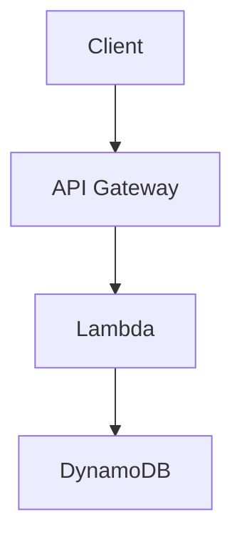

# Obsidian Cloud KMS Encryption

[](https://snyk.io/test/github/ViktorUJ/obsidian-cloud-kms)

Плагин для [Obsidian](https://obsidian.md), обеспечивающий **прозрачное шифрование** секретных блоков и бинарных файлов с использованием AWS KMS.

## Оглавление

- [Зачем](#зачем)
- [Ключевые принципы](#ключевые-принципы)
- [Как работает](#как-работает)
- [Команды](#команды)
- [Использование](#использование)
  - [Шифрование текста в заметках](#шифрование-текста-в-заметках)
  - [Вложенные code fences (mermaid, code)](#вложенные-code-fences-mermaid-code-и-тд)
  - [Шифрование бинарных файлов](#шифрование-бинарных-файлов)
  - [Удаление шифрования текста](#удаление-шифрования-текста)
- [Поведение](#поведение)
- [Установка](#установка)
  - [Требования](#требования)
  - [Из GitHub Releases](#из-github-releases)
  - [Из исходников](#из-исходников)
  - [Настройка AWS](#настройка-aws)
- [Настройки](#настройки)
- [Безопасность](#безопасность)
- [On-Disk Format](#on-disk-format)
- [Управление доступом к ключу](#управление-доступом-к-ключу)
  - [Пользователь из того же AWS-аккаунта](#пользователь-из-того-же-aws-аккаунта)
  - [Пользователь из той же AWS Organization](#пользователь-из-той-же-aws-organization-другой-аккаунт)
  - [Пользователь из сторонней организации](#пользователь-из-сторонней-организации-внешний-aws-аккаунт)
- [Development](#development)
- [Лицензия](LICENSE)

## Зачем

Если вы храните Obsidian-хранилище в S3, Git или любом другом удалённом хранилище — содержимое заметок доступно любому, кто получит доступ к storage. Этот плагин реализует модель **Zero Trust Storage**: на диске и в remote всегда лежит только шифротекст. Расшифровка происходит локально, в памяти, только при наличии доступа к Cloud KMS.

## Ключевые принципы

- **Envelope Encryption** — каждый блок/файл шифруется уникальным DEK (AES-256-GCM), а сам DEK оборачивается CMK в облачном KMS
- **Identity-based Auth** — никаких паролей; используются системные credentials (AWS SSO, IAM Role, `~/.aws/credentials`)
- **Local-First Crypto** — симметричное шифрование выполняется локально через WebCrypto API; в KMS уходит только DEK для wrap/unwrap
- **Zero Cleartext on Disk** — расшифрованный контент существует только в оперативной памяти процесса Obsidian
- **Transparent** — шифрование/расшифровка происходит автоматически при чтении/записи файлов (monkey-patch vault adapter)
- **Nested Content** — маркеры `%%secret-start%%` / `%%secret-end%%` не конфликтуют с code fences, позволяя вкладывать ```mermaid, ```js и любой другой markdown

## Как работает

### Markdown-файлы (секретные блоки)

Плагин перехватывает чтение и запись файлов на уровне Obsidian vault adapter:

- **При записи на диск**: все блоки между `%%secret-start%%` и `%%secret-end%%` автоматически шифруются → на диске хранятся как ````ocke-v1
- **При чтении с диска**: все ````ocke-v1 блоки автоматически расшифровываются → в редакторе показываются между `%%secret-start%%` / `%%secret-end%%`

### Бинарные файлы (PDF, изображения, аудио)

- Команда **"Encrypt current file"** шифрует файл на месте (имя не меняется)
- При открытии — файл расшифровывается в памяти (Blob URL), Obsidian показывает его как обычно
- На диске всегда зашифрованные байты в формате OCKE
- В file explorer зашифрованные файлы отмечены 🔒

## Команды

| Команда | Описание |
|---------|----------|
| **Wrap selection in secret block** | Оборачивает выделенный текст в `%%secret-start%%` / `%%secret-end%%` |
| **Unwrap secret block** | Убирает маркеры шифрования, оставляя plaintext |
| **Encrypt current file with AWS KMS** | Шифрует бинарный файл (PDF, PNG, MP3) на месте |
| **Decrypt current file with AWS KMS (permanent)** | Расшифровывает бинарный файл навсегда (записывает plaintext на диск) |

## Использование

### Шифрование текста в заметках

1. Выделите текст в заметке
2. `Ctrl+P` → **"Wrap selection in secret block"**
3. Текст оборачивается в `%%secret-start%%` / `%%secret-end%%` маркеры
4. При сохранении — автоматически шифруется на диске

### Ручное создание секретного блока

Просто оберните текст в маркеры:

```markdown
# Моя заметка

Это публичный текст.

%%secret-start%%
Это секретный контент — будет зашифрован при сохранении.
Пароли, токены, приватные заметки — всё что угодно.
%%secret-end%%

А это снова публичный текст.
```

### Вложенные code fences (mermaid, code и т.д.)

Маркеры `%%` — это Obsidian-комментарии, невидимые в Reading view. Содержимое между ними — обычный markdown, который рендерится нормально:

```markdown
%%secret-start%%
# Секретная архитектура



```bash
export SECRET_KEY="my-super-secret-key"
aws s3 cp secret.tar.gz s3://my-bucket/
```

Пароль от продакшена: `P@ssw0rd123!`
%%secret-end%%
```

После сохранения весь блок (включая mermaid-диаграмму и код) будет зашифрован на диске. При открытии — расшифрован, и mermaid отрендерится как диаграмма в Reading view.

### Шифрование бинарных файлов

1. Откройте PDF, изображение или другой бинарный файл
2. `Ctrl+P` → **"Encrypt current file with AWS KMS"**
3. Файл зашифрован на месте (имя не меняется, в file explorer появляется 🔒)
4. При следующем открытии — расшифровывается в памяти, отображается как обычно

Для **постоянной** расшифровки (записать plaintext обратно на диск):
- `Ctrl+P` → **"Decrypt current file with AWS KMS (permanent)"**

### Удаление шифрования текста

1. Выделите весь блок (от `%%secret-start%%` до `%%secret-end%%`)
2. `Ctrl+P` → **"Unwrap secret block"**
3. Маркеры убираются, текст остаётся как обычный markdown (больше не шифруется)

## Поведение

| Ситуация | Результат |
|----------|-----------|
| Сохранение .md с `%%secret-start%%` блоками | Блоки шифруются → на диске ````ocke-v1 |
| Открытие .md с ````ocke-v1 блоками (ключ доступен) | Расшифровываются → в редакторе `%%secret-start%%...%%secret-end%%` |
| Открытие .md с ````ocke-v1 блоками (ключ НЕ доступен) | Остаются как ````ocke-v1 (зашифрованный base64) |
| Открытие зашифрованного PDF/PNG (ключ доступен) | Расшифровывается в памяти → отображается нормально |
| Открытие зашифрованного PDF/PNG (ключ НЕ доступен) | Obsidian не может отрендерить файл |
| KMS недоступен при сохранении | Файл сохраняется как есть, ошибка показывается |
| Каждый блок/файл | Шифруется независимо (свой DEK) |
| File explorer | Зашифрованные бинарные файлы отмечены 🔒 |

## Установка

### Требования

- Obsidian ≥ 1.4.0 (desktop)
- AWS credentials настроены (`~/.aws/credentials` или `aws sso login`)

### Из GitHub Releases

1. Перейдите в [Releases](https://github.com/ViktorUJ/obsidian-cloud-kms/releases)
2. Скачайте из последнего релиза: `main.js`, `manifest.json`
3. Создайте папку `.obsidian/plugins/obsidian-cloud-kms-encryption/` в вашем хранилище
4. Положите скачанные файлы в эту папку
5. Перезапустите Obsidian → Settings → Community Plugins → включите "Cloud KMS Encryption"

### Из исходников

```bash
git clone https://github.com/ViktorUJ/obsidian-cloud-kms.git
cd obsidian-cloud-kms
npm install
npm run build
```

Скопируйте `main.js` и `manifest.json` в `.obsidian/plugins/obsidian-cloud-kms-encryption/`.

### Настройка AWS

1. Создайте KMS-ключ:
   ```bash
   aws kms create-key --key-spec SYMMETRIC_DEFAULT --key-usage ENCRYPT_DECRYPT --region eu-north-1
   ```

2. Скопируйте ARN ключа (формат: `arn:aws:kms:{region}:{account}:key/{key-id}`)

3. В Obsidian: Settings → Cloud KMS Encryption → вставьте ARN

4. Убедитесь, что credentials доступны:
   ```bash
   aws sts get-caller-identity
   ```

> **Примечание**: регион извлекается из ARN автоматически — не нужно настраивать `AWS_REGION`.

## Настройки

| Параметр | Описание | По умолчанию |
|----------|----------|--------------|
| AWS KMS Key ARN | ARN ключа для шифрования | — |
| Auto-decrypt blocks | Автоматическая расшифровка при чтении | ✅ |

## Безопасность

- Расшифрованные данные **никогда не записываются на диск** — adapter patch шифрует перед записью
- Бинарные файлы расшифровываются в Blob URL (RAM), не на диск
- DEK обнуляется сразу после использования
- Каждый блок/файл использует уникальный DEK + nonce
- AES-256-GCM с 96-bit nonce и 128-bit auth tag
- Encryption context привязан к vault name + file path + format version
- Все KMS-вызовы логируются в AWS CloudTrail
- LRU-кеш на 20 расшифрованных бинарных файлов (старые вытесняются из памяти)

## On-Disk Format

### Markdown (секретные блоки)

На диске секретные блоки хранятся как:

`````
````ocke-v1
<base64-encoded encrypted data>
````
`````

### Бинарные файлы

Файл целиком заменяется на OCKE бинарный формат:

```
[Magic: "OCKE" 4B][Version: uint16 BE][ProviderIdLen: 1B][ProviderId]
[CmkIdLen: uint16 BE][CmkId][WrappedDekLen: uint16 BE][WrappedDek]
[Nonce: 12B][AuthTag: 16B][CiphertextLen: uint32 BE][Ciphertext]
```

## Development

```bash
npm test          # Запуск тестов
npm run build     # Production build
npm run dev       # Dev build (watch)
make ci           # Full CI pipeline
```

## Управление доступом к ключу

### Пользователь из того же AWS-аккаунта

Добавьте IAM-политику пользователю/роли:

```json
{
  "Version": "2012-10-17",
  "Statement": [
    {
      "Effect": "Allow",
      "Action": [
        "kms:Decrypt",
        "kms:GenerateDataKey",
        "kms:DescribeKey"
      ],
      "Resource": "arn:aws:kms:eu-north-1:790660747904:key/YOUR-KEY-ID"
    }
  ]
}
```

```bash
aws iam put-user-policy \
  --user-name colleague \
  --policy-name kms-vault-access \
  --policy-document file://policy.json
```

Для read-only доступа (только расшифровка) — уберите `kms:GenerateDataKey`.

### Пользователь из той же AWS Organization (другой аккаунт)

**Шаг 1.** Обновите Key Policy на стороне владельца ключа — разрешите доступ из другого аккаунта:

```json
{
  "Sid": "AllowCrossAccountDecrypt",
  "Effect": "Allow",
  "Principal": {
    "AWS": "arn:aws:iam::111122223333:root"
  },
  "Action": [
    "kms:Decrypt",
    "kms:GenerateDataKey",
    "kms:DescribeKey"
  ],
  "Resource": "*"
}
```

```bash
# Получить текущую политику ключа
aws kms get-key-policy --key-id YOUR-KEY-ID --policy-name default --output text > key-policy.json

# Добавить Statement выше в key-policy.json, затем:
aws kms put-key-policy --key-id YOUR-KEY-ID --policy-name default --policy file://key-policy.json
```

**Шаг 2.** На стороне другого аккаунта (111122223333) — добавьте IAM-политику пользователю:

```json
{
  "Version": "2012-10-17",
  "Statement": [
    {
      "Effect": "Allow",
      "Action": [
        "kms:Decrypt",
        "kms:GenerateDataKey",
        "kms:DescribeKey"
      ],
      "Resource": "arn:aws:kms:eu-north-1:790660747904:key/YOUR-KEY-ID"
    }
  ]
}
```

> Оба условия обязательны: Key Policy разрешает аккаунт, IAM Policy разрешает пользователя.

### Пользователь из сторонней организации (внешний AWS-аккаунт)

Аналогично cross-account, но с дополнительными ограничениями через `Condition`:

**Шаг 1.** Key Policy — разрешите конкретного пользователя/роль (не весь аккаунт):

```json
{
  "Sid": "AllowExternalPartnerDecrypt",
  "Effect": "Allow",
  "Principal": {
    "AWS": "arn:aws:iam::444455556666:user/partner-user"
  },
  "Action": [
    "kms:Decrypt",
    "kms:DescribeKey"
  ],
  "Resource": "*",
  "Condition": {
    "StringEquals": {
      "kms:EncryptionContext:vaultName": "shared-vault"
    }
  }
}
```

> **Рекомендации для внешних партнёров:**
> - Указывайте конкретный Principal (user/role ARN), не `root` аккаунта
> - Давайте только `kms:Decrypt` (без `GenerateDataKey`) — только чтение
> - Используйте `Condition` с `kms:EncryptionContext` для ограничения доступа к конкретному vault
> - Включите CloudTrail для аудита всех обращений к ключу

**Шаг 2.** Партнёр добавляет IAM-политику на своей стороне (как в cross-account выше).

**Шаг 3.** Партнёр настраивает плагин с тем же ARN ключа и получает доступ к расшифровке.

### Проверка доступа

```bash
# От имени пользователя, которому дали доступ:
aws kms describe-key --key-id arn:aws:kms:eu-north-1:790660747904:key/YOUR-KEY-ID

# Если вернёт метаданные ключа — доступ есть
# Если AccessDeniedException — проверьте Key Policy + IAM Policy
```

## Лицензия

[MIT](LICENSE) © Viktar Mikalayeu
