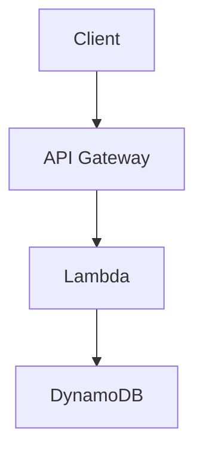

# Obsidian Cloud KMS Encryption

> 🇷🇺 [Документация на русском](README_RU.md)

[](https://github.com/ViktorUJ/obsidian-cloud-kms/actions/workflows/ci.yml)
[](https://github.com/ViktorUJ/obsidian-cloud-kms/actions/workflows/codeql.yml)
[](https://scorecard.dev/viewer/?uri=github.com/ViktorUJ/obsidian-cloud-kms)
[](https://www.bestpractices.dev/projects/9999)
[](https://snyk.io/test/github/ViktorUJ/obsidian-cloud-kms)
[](https://slsa.dev)
[](LICENSE)

An [Obsidian](https://obsidian.md) plugin providing **transparent encryption** of secret blocks and binary files using AWS KMS.

## Table of Contents

- [Why](#why)
- [Key Principles](#key-principles)
- [How It Works](#how-it-works)
- [Commands](#commands)
- [Usage](#usage)
  - [Encrypting text in notes](#encrypting-text-in-notes)
  - [Nested code fences (mermaid, code)](#nested-code-fences-mermaid-code-etc)
  - [Encrypting binary files](#encrypting-binary-files)
  - [Removing encryption](#removing-encryption)
- [Behavior](#behavior)
- [Installation](#installation)
  - [Requirements](#requirements)
  - [From GitHub Releases](#from-github-releases)
  - [From source](#from-source)
  - [AWS Setup](#aws-setup)
- [Settings](#settings)
- [Security](SECURITY.md)
- [Security Testing](SECURITY_TESTING.md)
- [Reproducible Builds](REPRODUCIBLE_BUILDS.md)
- [Verifying Release Integrity](#verifying-release-integrity)
- [On-Disk Format](#on-disk-format)
- [Key Access Management](#key-access-management)
  - [Multi-Key Architecture](#multi-key-architecture)
  - [User from the same AWS account](#user-from-the-same-aws-account)
  - [User from the same AWS Organization](#user-from-the-same-aws-organization-different-account)
  - [User from an external organization](#user-from-an-external-organization-external-aws-account)
- [CLI Decryption (without Obsidian)](#cli-decryption-without-obsidian)
  - [Key Rotation / Migration (ocke-rekey)](#key-rotation--migration-ocke-rekey)
- [Comparison with Alternatives](#comparison-with-alternatives)
- [Git Workflow](#git-workflow)
- [KMS Status Indicator](#kms-status-indicator)
- [Known Limitations](#known-limitations)
- [Development](#development)
- [License](LICENSE)

## Why

If you store your Obsidian vault in S3, Git, or any other remote storage — note contents are accessible to anyone who gains access to that storage. This plugin implements a **Zero Trust Storage** model: only ciphertext exists on disk and in remote. Decryption happens locally, in memory, only when Cloud KMS access is available.

## Key Principles

- **Envelope Encryption** — each block/file is encrypted with a unique DEK (AES-256-GCM), and the DEK itself is wrapped by a CMK in cloud KMS
- **Identity-based Auth** — no passwords; uses system credentials (AWS SSO, IAM Role, `~/.aws/credentials`)
- **Local-First Crypto** — symmetric encryption runs locally via WebCrypto API; only the DEK goes to KMS for wrap/unwrap
- **Zero Cleartext on Disk** — decrypted content exists only in Obsidian process memory
- **Transparent** — encryption/decryption happens automatically on file read/write (monkey-patch vault adapter)
- **Nested Content** — `%%secret-start%%` / `%%secret-end%%` markers don't conflict with code fences, allowing nested ```mermaid, ```js and any other markdown

## How It Works

### Markdown files (secret blocks)

The plugin intercepts file reads and writes at the Obsidian vault adapter level:

- **On write to disk**: all blocks between `%%secret-start%%` and `%%secret-end%%` are automatically encrypted → stored on disk as `ocke-v1` block
- **On read from disk**: all `ocke-v1` blocks are automatically decrypted → shown in editor between `%%secret-start%%` / `%%secret-end%%`

### Binary files (PDF, images, audio)

- **"Encrypt current file"** command encrypts the file in place (name unchanged)
- On open — file is decrypted in memory (Blob URL), Obsidian displays it normally
- Disk always contains encrypted bytes in OCKE format
- Encrypted files are marked with 🔒 in the file explorer

## Commands

| Command | Description |
|---------|-------------|
| **Wrap selection in secret block** | Wraps selected text in `%%secret-start%%` / `%%secret-end%%` |
| **Unwrap secret block** | Removes encryption markers, leaving plaintext |
| **Encrypt current file with AWS KMS** | Encrypts a binary file (PDF, PNG, MP3) in place |
| **Decrypt current file with AWS KMS (permanent)** | Permanently decrypts a binary file (writes plaintext to disk) |

## Usage

### Encrypting text in notes

1. Select text in a note
2. `Ctrl+P` → **"Wrap selection in secret block"**
3. Text is wrapped in `%%secret-start%%` / `%%secret-end%%` markers
4. On save — automatically encrypted on disk

### Creating a secret block manually

Simply wrap text in markers:

```markdown
# My note

This is public text.

%%secret-start%%
This is secret content — will be encrypted on save.
Passwords, tokens, private notes — anything.
%%secret-end%%

This is public text again.
```

### Nested code fences (mermaid, code, etc.)

`%%` markers are Obsidian comments, invisible in Reading view. Content between them is regular markdown that renders normally:

````markdown
%%secret-start%%
# Secret Architecture



```bash
export SECRET_KEY="my-super-secret-key"
aws s3 cp secret.tar.gz s3://my-bucket/
```

Production password: `P@ssw0rd123!`
%%secret-end%%
````

After saving, the entire block (including mermaid diagram and code) is encrypted on disk. On open — decrypted, and mermaid renders as a diagram in Reading view.

### Encrypting binary files

1. Open a PDF, image, or other binary file
2. `Ctrl+P` → **"Encrypt current file with AWS KMS"**
3. File is encrypted in place (name unchanged, 🔒 appears in file explorer)
4. On next open — decrypted in memory, displayed normally

For **permanent** decryption (write plaintext back to disk):
- `Ctrl+P` → **"Decrypt current file with AWS KMS (permanent)"**

### Removing encryption

1. Select the entire block (from `%%secret-start%%` to `%%secret-end%%`)
2. `Ctrl+P` → **"Unwrap secret block"**
3. Markers are removed, text remains as regular markdown (no longer encrypted)

## Behavior

| Situation | Result |
|-----------|--------|
| Saving .md with `%%secret-start%%` blocks | Blocks encrypted → `ocke-v1` block on disk |
| Opening .md with `ocke-v1` blocks (key available) | Decrypted → `%%secret-start%%...%%secret-end%%` in editor |
| Opening .md with `ocke-v1` blocks (key NOT available) | Remain as `ocke-v1` (encrypted base64) |
| Opening encrypted PDF/PNG (key available) | Decrypted in memory → displayed normally |
| Opening encrypted PDF/PNG (key NOT available) | Obsidian cannot render the file |
| KMS unavailable on save | File saved as-is, error shown |
| Each block/file | Encrypted independently (own DEK) |
| File explorer | Encrypted binary files marked with 🔒 |

## Installation

### Requirements

- Obsidian ≥ 1.4.0 (desktop)
- AWS credentials configured (`~/.aws/credentials` or `aws sso login`)

### From GitHub Releases

1. Go to [Releases](https://github.com/ViktorUJ/obsidian-cloud-kms/releases)
2. Download from the latest release: `main.js`, `manifest.json`, `styles.css`
3. Create folder `.obsidian/plugins/cloud-kms-encryption/` in your vault
4. Place downloaded files in that folder
5. Restart Obsidian → Settings → Community Plugins → enable "Cloud KMS Encryption"

### From source

```bash
git clone https://github.com/ViktorUJ/obsidian-cloud-kms.git
cd obsidian-cloud-kms
npm install
npm run build
```

Copy `main.js`, `manifest.json`, and `styles.css` to `.obsidian/plugins/cloud-kms-encryption/`.

### AWS Setup

1. Create a KMS key:
   ```bash
   aws kms create-key --key-spec SYMMETRIC_DEFAULT --key-usage ENCRYPT_DECRYPT --region eu-north-1
   ```

2. Copy the key ARN (format: `arn:aws:kms:{region}:{account}:key/{key-id}`)

3. In Obsidian: Settings → Cloud KMS Encryption → paste the ARN

4. Verify credentials are available:
   ```bash
   aws sts get-caller-identity
   ```

> **Note**: region is extracted from the ARN automatically — no need to configure `AWS_REGION`.

## Settings

| Parameter | Description | Default |
|-----------|-------------|---------|
| AWS KMS Key ARN | Key ARN for encryption | — |
| Auto-decrypt blocks | Automatic decryption on read | ✅ |

## Security

Detailed threat model, cryptographic design, and limitations are described in [SECURITY.md](SECURITY.md).

Key points:

- Decrypted data is **never written to disk** — adapter patch encrypts before write
- Binary files are decrypted to Blob URL (RAM), not to disk
- DEK is zeroed immediately after use
- Each block/file uses a unique DEK + nonce
- AES-256-GCM with 96-bit nonce and 128-bit auth tag
- Encryption context bound to vault name + file path + format version
- All KMS calls are logged in AWS CloudTrail
- LRU cache of 20 decrypted binary files (old ones evicted from memory)
- No telemetry, no external calls except to AWS KMS
- Credentials are not stored by the plugin — standard AWS credential chain is used

## Verifying Release Integrity

Every release is cryptographically signed. You can verify that downloaded artifacts are authentic and untampered:

### Verify SLSA Provenance

```bash
# Install GitHub CLI if not already
# Then verify the artifact was built in GitHub Actions:
gh attestation verify main.js --repo ViktorUJ/obsidian-cloud-kms
```

### Verify Cosign Signature

```bash
# Install cosign: https://docs.sigstore.dev/cosign/system_config/installation/
# Download main.js and main.js.bundle from the release, then:
cosign verify-blob main.js \
  --bundle main.js.bundle \
  --certificate-identity-regexp "github.com/ViktorUJ/obsidian-cloud-kms" \
  --certificate-oidc-issuer "https://token.actions.githubusercontent.com"
```

If verification succeeds — the file was built in this repository's GitHub Actions, not modified after build.

### Verify SBOM

Each release includes `sbom.spdx.json` — a complete list of all bundled dependencies with versions and licenses. Use it to:
- Scan for known vulnerabilities: `grype sbom.spdx.json`
- Check license compliance: `trivy sbom sbom.spdx.json`

## On-Disk Format

### Markdown (secret blocks)

On disk, secret blocks are stored as:

`````
````ocke-v1
<base64-encoded encrypted data>
````
`````

### Binary files

The file is entirely replaced with OCKE binary format:

```
[Magic: "OCKE" 4B][Version: uint16 BE][ProviderIdLen: 1B][ProviderId]
[CmkIdLen: uint16 BE][CmkId][WrappedDekLen: uint16 BE][WrappedDek]
[Nonce: 12B][AuthTag: 16B][CiphertextLen: uint32 BE][Ciphertext]
```

## Key Access Management

### Multi-Key Architecture

In organizations, different teams need access to different secrets. This plugin supports multiple KMS keys, allowing fine-grained access control:

**Use case:** A company vault shared across teams:
- **Finance team** — access to budget data, salaries, contracts
- **R&D team** — access to patents, research, technical secrets
- **CTO** — access to everything (all keys)

Each secret block is encrypted with a specific key. IAM policies on the AWS side control who can decrypt what. A developer from R&D physically cannot decrypt finance data — even if they have access to the vault files.

**Plugin settings:**
```json
{
  "keys": [
    { "alias": "finance", "arn": "arn:aws:kms:eu-north-1:790660747904:key/aaa-111" },
    { "alias": "rnd", "arn": "arn:aws:kms:eu-north-1:790660747904:key/bbb-222" },
    { "alias": "cto", "arn": "arn:aws:kms:eu-north-1:790660747904:key/ccc-333" }
  ],
  "defaultKeyAlias": "finance"
}
```

**In notes — specify key alias in the marker:**
```markdown
%%secret-start:finance%%
Q3 Budget: $2.4M
Salaries: ...
%%secret-end%%

%%secret-start:rnd%%
Patent application for new algorithm: ...
%%secret-end%%

%%secret-start:cto%%
Production root credentials: ...
%%secret-end%%
```

**Behavior:**
- When encrypting: if multiple keys are configured, a picker appears to choose which key to use
- When decrypting: the key ARN is stored inside the encrypted data — the plugin automatically uses it
- If the user has IAM access to the key → block is decrypted
- If not → block remains encrypted (graceful degradation)
- A single note can contain blocks encrypted with different keys

**IAM setup on AWS side:**
- Finance team → IAM policy allows only `kms:Decrypt` on `key/aaa-111`
- R&D team → IAM policy allows only `kms:Decrypt` on `key/bbb-222`
- CTO → IAM policy allows `kms:Decrypt` on all three keys

### User from the same AWS account

Add an IAM policy to the user/role:

```json
{
  "Version": "2012-10-17",
  "Statement": [
    {
      "Effect": "Allow",
      "Action": [
        "kms:Decrypt",
        "kms:GenerateDataKey",
        "kms:DescribeKey"
      ],
      "Resource": "arn:aws:kms:eu-north-1:790660747904:key/YOUR-KEY-ID"
    }
  ]
}
```

```bash
aws iam put-user-policy \
  --user-name colleague \
  --policy-name kms-vault-access \
  --policy-document file://policy.json
```

For read-only access (decryption only) — remove `kms:GenerateDataKey`.

### User from the same AWS Organization (different account)

**Step 1.** Update the Key Policy on the key owner's side — allow access from another account:

```json
{
  "Sid": "AllowCrossAccountDecrypt",
  "Effect": "Allow",
  "Principal": {
    "AWS": "arn:aws:iam::111122223333:root"
  },
  "Action": [
    "kms:Decrypt",
    "kms:GenerateDataKey",
    "kms:DescribeKey"
  ],
  "Resource": "*"
}
```

```bash
# Get current key policy
aws kms get-key-policy --key-id YOUR-KEY-ID --policy-name default --output text > key-policy.json

# Add the Statement above to key-policy.json, then:
aws kms put-key-policy --key-id YOUR-KEY-ID --policy-name default --policy file://key-policy.json
```

**Step 2.** On the other account's side (111122223333) — add IAM policy to the user:

```json
{
  "Version": "2012-10-17",
  "Statement": [
    {
      "Effect": "Allow",
      "Action": [
        "kms:Decrypt",
        "kms:GenerateDataKey",
        "kms:DescribeKey"
      ],
      "Resource": "arn:aws:kms:eu-north-1:790660747904:key/YOUR-KEY-ID"
    }
  ]
}
```

> Both conditions are required: Key Policy allows the account, IAM Policy allows the user.

### User from an external organization (external AWS account)

Similar to cross-account, but with additional restrictions via `Condition`:

**Step 1.** Key Policy — allow a specific user/role (not the entire account):

```json
{
  "Sid": "AllowExternalPartnerDecrypt",
  "Effect": "Allow",
  "Principal": {
    "AWS": "arn:aws:iam::444455556666:user/partner-user"
  },
  "Action": [
    "kms:Decrypt",
    "kms:DescribeKey"
  ],
  "Resource": "*",
  "Condition": {
    "StringEquals": {
      "kms:EncryptionContext:vaultName": "shared-vault"
    }
  }
}
```

> **Recommendations for external partners:**
> - Specify a concrete Principal (user/role ARN), not account `root`
> - Grant only `kms:Decrypt` (without `GenerateDataKey`) — read-only
> - Use `Condition` with `kms:EncryptionContext` to restrict access to a specific vault
> - Enable CloudTrail for auditing all key access

**Step 2.** Partner adds IAM policy on their side (same as cross-account above).

**Step 3.** Partner configures the plugin with the same key ARN and gains decryption access.

### Verifying access

```bash
# As the user who was granted access:
aws kms describe-key --key-id arn:aws:kms:eu-north-1:790660747904:key/YOUR-KEY-ID

# If it returns key metadata — access is granted
# If AccessDeniedException — check Key Policy + IAM Policy
```

## Comparison with Alternatives

| Feature | Cloud KMS Encryption | SOPS | git-crypt | Meld Encrypt | HashiCorp Vault |
|---------|---------------------|------|-----------|--------------|-----------------|
| Encryption at rest | ✅ | ✅ | ✅ | ✅ | ✅ |
| No passwords | ✅ (IAM) | ✅ (IAM/PGP) | ✅ (GPG) | ❌ (password) | ✅ (tokens) |
| Per-block granularity | ✅ | ✅ | ❌ (whole file) | ✅ | N/A |
| Multi-key / multi-team | ✅ | ✅ | ✅ | ❌ | ✅ |
| Git-safe (ciphertext in repo) | ✅ | ✅ | ✅ | ✅ | N/A |
| Transparent edit (no manual decrypt) | ✅ | ❌ (CLI) | ✅ | ❌ (modal) | N/A |
| Binary file encryption | ✅ | ❌ | ✅ | ❌ | N/A |
| Obsidian integration | ✅ native | ❌ | ❌ | ✅ native | ❌ |
| Audit trail (CloudTrail) | ✅ | ✅ | ❌ | ❌ | ✅ |
| External audit / certification | ❌ | ❌ | ❌ | ❌ | ✅ |
| HSM-grade security | ❌ | ❌ | ❌ | ❌ | ✅ |

**Best fit:**
- **Cloud KMS Encryption** — team knowledge bases with IAM access control, DevOps secrets in Obsidian
- **SOPS** — CI/CD secrets in YAML/JSON files, GitOps workflows
- **git-crypt** — whole-file encryption in Git repos, developer workflows
- **Meld Encrypt** — personal password-protected notes, single-user
- **HashiCorp Vault** — production infrastructure secrets, compliance requirements

## Git Workflow

This plugin is designed to work with Git-stored vaults. On disk, only ciphertext exists — safe to commit and push.

### Initial setup

```bash
# Clone the vault
git clone git@github.com:your-org/team-vault.git
cd team-vault

# Open in Obsidian, configure the plugin with your KMS key ARN
# Ensure AWS credentials are available:
aws sts get-caller-identity
```

### Daily workflow

```bash
# Pull latest changes (encrypted on disk)
cd /path/to/vault
git pull

# Open Obsidian — plugin decrypts blocks transparently
# Edit notes as usual — secret blocks show decrypted content
# Close Obsidian or just switch to terminal

# Commit and push (only ciphertext goes to Git)
git add -A
git status          # verify: no plaintext in diff
git commit -m "update finance Q3 notes"
git push
```

### Verifying no plaintext leaks to Git

```bash
# Check what's actually in the file on disk:
cat notes/budget.md
# You should see: ocke-v1 block with base64 — NOT plaintext

# Check diff before committing:
git diff --cached
# Encrypted blocks show as base64 changes, not readable text

# For binary files:
file attachments/report.pdf
# Should show: "data" (not "PDF document") — it's encrypted bytes
```

### Team onboarding

```bash
# New team member:
# 1. Clone the vault
git clone git@github.com:your-org/team-vault.git

# 2. Configure AWS credentials
aws configure
# or: aws sso login --profile team

# 3. Install plugin in Obsidian, set the same KMS key ARN
# 4. IAM admin grants kms:Decrypt permission on the relevant key(s)

# 5. Open vault in Obsidian — blocks they have access to are decrypted
#    Blocks they DON'T have access to remain as encrypted base64
```

### Conflict resolution

```bash
# If Git shows merge conflict in an encrypted block:
# DON'T try to merge the base64 manually — it's binary data

# Option 1: Accept theirs or ours
git checkout --theirs notes/budget.md
# or
git checkout --ours notes/budget.md

# Option 2: Re-encrypt after resolving in Obsidian
# 1. Accept one version
# 2. Open in Obsidian, edit the decrypted content
# 3. Save — plugin re-encrypts with new DEK
# 4. Commit
```

### .gitignore recommendations

```gitignore
# Obsidian workspace (contains open file state, not secrets)
.obsidian/workspace.json
.obsidian/workspace-mobile.json

# Plugin data (contains your KMS ARN — not secret, but personal)
.obsidian/plugins/obsidian-cloud-kms-encryption/data.json

# Never ignore these (they ARE the encrypted vault):
# !*.md
# !attachments/
```

### Pre-commit hook: plaintext leak protection

If the plugin was disabled, credentials expired, or a file was edited outside Obsidian — `%%secret-start%%` markers might end up on disk unencrypted. A pre-commit hook prevents accidentally committing plaintext to Git:

```bash
# Install the hook
cp tools/pre-commit-hook.sh .git/hooks/pre-commit
chmod +x .git/hooks/pre-commit
```

What it does:
- On every `git commit`, checks all staged `.md` files
- If any file contains `%%secret-start%%` — **blocks the commit**
- Shows which file has unencrypted content and how to fix it

Example output when plaintext is detected:
```
ERROR: Plaintext secret block found in staged file: notes/budget.md
  The file contains %%secret-start%% markers which means
  the encryption plugin did not encrypt before save.

  Fix: Open the file in Obsidian with the plugin enabled,
  save it, then stage again.

Commit blocked: plaintext secrets detected.
```

> This is a safety net — if everything works correctly, `%%secret-start%%` should never appear on disk (the adapter patch encrypts it to `ocke-v1` block before write). The hook catches edge cases.

## CLI Decryption (without Obsidian)

For disaster recovery, CI/CD pipelines, or backup verification — you can decrypt files without Obsidian using CLI tools.

> **Important:** Encryption context (`vault-name` and `file-path`) must match what was used during encryption. The vault name is the folder name of your Obsidian vault. The file path is vault-relative (e.g., `folder/note.md`).

### Option 1: Bash + AWS CLI + Python

Zero Node.js dependencies. Requires: `aws` CLI, `python3`, `pip install cryptography`.

```bash
# Decrypt a binary file (PDF, image)
./tools/ocke-decrypt.sh report.pdf --vault-name my-vault --file-path report.pdf -o decrypted-report.pdf

# Decrypt markdown blocks (prints to stdout)
./tools/ocke-decrypt.sh notes/secret.md --vault-name my-vault --file-path notes/secret.md

# Using environment variables
OCKE_VAULT_NAME="my-vault" OCKE_FILE_PATH="notes/secret.md" ./tools/ocke-decrypt.sh notes/secret.md -o decrypted.md
```

### Option 2: Node.js CLI

Requires: Node.js >= 18, `@aws-sdk/client-kms`.

```bash
# Install dependencies (one time)
npm install @aws-sdk/client-kms @aws-sdk/credential-provider-ini

# Decrypt a binary file
node tools/ocke-decrypt.mjs report.pdf --vault-name my-vault --file-path report.pdf -o decrypted-report.pdf

# Decrypt markdown blocks
node tools/ocke-decrypt.mjs notes/secret.md --vault-name my-vault --file-path notes/secret.md

# Using environment variables
OCKE_VAULT_NAME="my-vault" OCKE_FILE_PATH="notes/secret.md" node tools/ocke-decrypt.mjs notes/secret.md -o decrypted.md
```

### Parameters

| Parameter | Description | Required |
|-----------|-------------|----------|
| `<file>` | Path to the encrypted file | Yes |
| `-o <output>` | Write output to file (default: stdout) | No |
| `--vault-name` | Obsidian vault name (folder name) | Yes |
| `--file-path` | Vault-relative file path used during encryption | Yes |

Or via environment variables: `OCKE_VAULT_NAME`, `OCKE_FILE_PATH`.

> **How to find the correct values:**
> - `vault-name` — the folder name of your vault (e.g., if vault is at `/home/user/my-vault/`, the name is `my-vault`)
> - `file-path` — the path relative to vault root (e.g., `notes/secret.md`, `attachments/report.pdf`)

### When to use CLI

- **Disaster recovery** — Obsidian is unavailable, need to access encrypted data
- **CI/CD pipelines** — decrypt secrets during deployment without GUI
- **Backup verification** — confirm encrypted backups are valid
- **Migration** — bulk decrypt when moving away from the plugin

### Key Rotation / Migration (ocke-rekey)

Re-encrypt an entire vault with a new KMS key — for migrating to a new AWS account, rotating keys, or switching regions. Only the wrapped DEK is re-encrypted (fast), ciphertext is unchanged.

```bash
# Install dependencies
npm install @aws-sdk/client-kms @aws-sdk/credential-provider-ini

# Dry run — see what would change
node tools/ocke-rekey.mjs /path/to/vault \
  --new-key arn:aws:kms:eu-west-1:NEW_ACCOUNT:key/new-key-id \
  --vault-name my-vault \
  --dry-run

# Execute migration
node tools/ocke-rekey.mjs /path/to/vault \
  --new-key arn:aws:kms:eu-west-1:NEW_ACCOUNT:key/new-key-id \
  --vault-name my-vault

# Migrate only blocks encrypted with a specific old key
node tools/ocke-rekey.mjs /path/to/vault \
  --new-key arn:aws:kms:eu-west-1:NEW_ACCOUNT:key/new-key-id \
  --old-key arn:aws:kms:eu-north-1:OLD_ACCOUNT:key/old-key-id \
  --vault-name my-vault
```

**Requirements:**
- AWS credentials with `kms:Decrypt` on the old key AND `kms:Encrypt` on the new key
- Both keys must be accessible simultaneously during migration
- After migration, update the plugin settings with the new key ARN

> **Note:** On Windows, use Git Bash or WSL for correct Unicode file path handling.
> Both tools use the same AWS credentials as the plugin (`~/.aws/credentials`).
> The KMS key ARN is stored inside the encrypted data — no key configuration needed.

## KMS Status Indicator

The plugin displays a connection status indicator in Obsidian's bottom status bar:

| Indicator | Meaning |
|-----------|---------|
| 🔓 KMS | Connection OK — encryption/decryption available |
| 🔒 KMS ⚠️ | KMS unavailable — secret blocks will NOT be encrypted on save! |
| ⏳ KMS | Checking connection... |

**Behavior:**
- Checks KMS accessibility on plugin load
- Re-checks every 5 minutes in background
- Click the indicator to manually re-check
- Hover for detailed tooltip

**Why this matters:**
If KMS is unavailable (network issues, expired credentials, AWS outage), the plugin cannot encrypt `%%secret-start%%` blocks on save. The file will be saved with plaintext markers. The status indicator gives immediate visibility into this risk — if you see 🔒 ⚠️, do not save files with secret blocks until connectivity is restored.

## Known Limitations

### Vault Adapter Monkey-Patching

This plugin intercepts `vault.adapter.read()` and `vault.adapter.write()` to provide transparent encryption. This is the same approach used by [gpgCrypt](https://github.com/tejado/obsidian-gpgCrypt) and is the only way to guarantee zero-plaintext-on-disk without Obsidian providing an official encryption API.

**Potential conflicts with other plugins:**
- If another plugin also patches `adapter.read()` or `adapter.write()`, the two patches may conflict
- The plugin chains correctly (calls the original method after processing), but order of initialization matters
- If you experience issues, try disabling other plugins that modify file I/O behavior

**Mitigations:**
- The patch only processes `.md` files for text encryption (binary files checked by magic bytes)
- Files without `%%secret-start%%` markers or OCKE magic bytes pass through unchanged (zero overhead)
- On plugin unload, original adapter methods are fully restored
- The patch is transparent — other plugins reading/writing non-encrypted files are unaffected

**If Obsidian updates break the plugin:**
- Your data is safe — files remain encrypted on disk in documented OCKE format
- Use the [CLI tools](#cli-decryption-without-obsidian) to decrypt without Obsidian
- The plugin will be updated to match new Obsidian internals

## Development

```bash
npm test          # Run tests
npm run build     # Production build
npm run dev       # Dev build (watch)
make ci           # Full CI pipeline
```

## License

[MIT](LICENSE) © Viktar Mikalayeu
