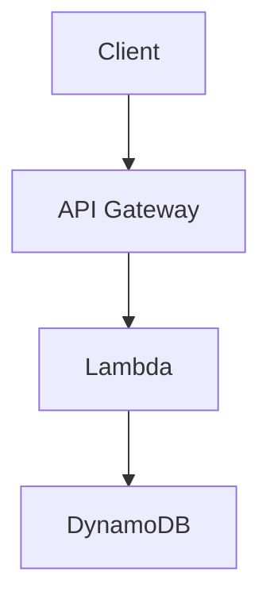

# Obsidian Cloud KMS Encryption

[](https://snyk.io/test/github/ViktorUJ/obsidian-cloud-kms)

Плагин для [Obsidian](https://obsidian.md), обеспечивающий **прозрачное шифрование** секретных блоков в заметках с использованием облачных KMS-сервисов (AWS KMS).

## Зачем

Если вы храните Obsidian-хранилище в S3, Git или любом другом удалённом хранилище — содержимое заметок доступно любому, кто получит доступ к storage. Этот плагин реализует модель **Zero Trust Storage**: на диске и в remote всегда лежит только шифротекст. Расшифровка происходит локально, в памяти, только при наличии доступа к Cloud KMS.

## Ключевые принципы

- **Envelope Encryption** — каждый блок шифруется уникальным DEK (AES-256-GCM), а сам DEK оборачивается CMK в облачном KMS
- **Identity-based Auth** — никаких паролей; используются системные credentials (AWS SSO, IAM Role, `~/.aws/credentials`)
- **Local-First Crypto** — симметричное шифрование выполняется локально через WebCrypto API; в KMS уходит только DEK для wrap/unwrap
- **Zero Cleartext on Disk** — расшифрованный контент существует только в оперативной памяти процесса Obsidian
- **Transparent** — шифрование/расшифровка происходит автоматически при чтении/записи файлов (monkey-patch vault adapter)
- **Nested Fences** — маркеры `%%secret-start%%` / `%%secret-end%%` не конфликтуют с code fences, позволяя вкладывать ```mermaid, ```js и любой другой markdown

## Как работает

Плагин перехватывает чтение и запись файлов на уровне Obsidian vault adapter:

- **При записи на диск**: все блоки между `%%secret-start%%` и `%%secret-end%%` автоматически шифруются → на диске хранятся как `````ocke-v1`
- **При чтении с диска**: все `````ocke-v1` блоки автоматически расшифровываются → в редакторе показываются между `%%secret-start%%` / `%%secret-end%%`

Вы работаете с расшифрованным текстом в редакторе, а на диске всегда лежит шифротекст.

## Использование

### Шифрование текста

1. Выделите текст в заметке
2. `Ctrl+P` → **"Wrap selection in secret block"**
3. Текст оборачивается в `%%secret-start%%` / `%%secret-end%%` маркеры
4. При сохранении — автоматически шифруется на диске

### Ручное создание секретного блока

Просто оберните текст в маркеры:

```markdown
# Моя заметка

Это публичный текст.

%%secret-start%%
Это секретный контент — будет зашифрован при сохранении.
Пароли, токены, приватные заметки — всё что угодно.
%%secret-end%%

А это снова публичный текст.
```

### Вложенные code fences (mermaid, code и т.д.)

Маркеры `%%` — это Obsidian-комментарии, невидимые в Reading view. Содержимое между ними — обычный markdown, который рендерится нормально:

```markdown
%%secret-start%%
# Секретная архитектура



```bash
export SECRET_KEY="my-super-secret-key"
aws s3 cp secret.tar.gz s3://my-bucket/
```

Пароль от продакшена: `P@ssw0rd123!`
%%secret-end%%
```

После сохранения весь блок (включая mermaid-диаграмму и код) будет зашифрован на диске. При открытии — расшифрован, и mermaid отрендерится как диаграмма в Reading view.

### Удаление шифрования

1. Выделите весь блок (от `%%secret-start%%` до `%%secret-end%%`)
2. `Ctrl+P` → **"Unwrap secret block"**
3. Маркеры убираются, текст остаётся как обычный markdown (больше не шифруется)

## Поведение

| Ситуация | Результат |
|----------|-----------|
| Сохранение файла с `%%secret-start%%` блоками | Блоки шифруются → на диске `````ocke-v1` |
| Открытие файла с `````ocke-v1` блоками (ключ доступен) | Блоки расшифровываются → в редакторе `%%secret-start%%...%%secret-end%%` |
| Открытие файла с `````ocke-v1` блоками (ключ НЕ доступен) | Блоки остаются как `````ocke-v1` (зашифрованный base64) |
| KMS недоступен при сохранении | Файл сохраняется как есть, ошибка показывается |
| Каждый блок | Шифруется независимо (свой DEK) |

## Установка

### Требования

- Obsidian ≥ 1.4.0 (desktop)
- AWS credentials настроены (`~/.aws/credentials` или `aws sso login`)

### Из GitHub Releases

1. Перейдите в [Releases](https://github.com/ViktorUJ/obsidian-cloud-kms/releases)
2. Скачайте из последнего релиза: `main.js`, `manifest.json`
3. Создайте папку `.obsidian/plugins/obsidian-cloud-kms-encryption/` в вашем хранилище
4. Положите скачанные файлы в эту папку
5. Перезапустите Obsidian → Settings → Community Plugins → включите "Cloud KMS Encryption"

### Из исходников

```bash
git clone https://github.com/ViktorUJ/obsidian-cloud-kms.git
cd obsidian-cloud-kms
npm install
npm run build
```

Скопируйте `main.js` и `manifest.json` в `.obsidian/plugins/obsidian-cloud-kms-encryption/`.

### Настройка AWS

1. Создайте KMS-ключ:
   ```bash
   aws kms create-key --key-spec SYMMETRIC_DEFAULT --key-usage ENCRYPT_DECRYPT --region eu-north-1
   ```

2. Скопируйте ARN ключа (формат: `arn:aws:kms:{region}:{account}:key/{key-id}`)

3. В Obsidian: Settings → Cloud KMS Encryption → вставьте ARN

4. Убедитесь, что credentials доступны:
   ```bash
   aws sts get-caller-identity
   ```

> **Примечание**: регион извлекается из ARN автоматически — не нужно настраивать `AWS_REGION`.

## Настройки

| Параметр | Описание | По умолчанию |
|----------|----------|--------------|
| AWS KMS Key ARN | ARN ключа для шифрования | — |
| Encrypted note suffix | Суффикс для полного шифрования файла | `.secret.md` |
| Auto-decrypt blocks | Автоматическая расшифровка при чтении | ✅ |

## Безопасность

- Расшифрованные данные **никогда не записываются на диск** — adapter patch шифрует перед записью
- DEK обнуляется сразу после использования
- Каждый блок использует уникальный DEK + nonce
- AES-256-GCM с 96-bit nonce и 128-bit auth tag
- Encryption context привязан к vault name + file path + format version
- Все KMS-вызовы логируются в AWS CloudTrail

## On-Disk Format

На диске секретные блоки хранятся как:

````
````ocke-v1
<base64-encoded encrypted data>
````
````

Бинарный формат внутри base64 (OCKE v1):

```
[Magic: "OCKE" 4B][Version: uint16 BE][ProviderIdLen: 1B][ProviderId]
[CmkIdLen: uint16 BE][CmkId][WrappedDekLen: uint16 BE][WrappedDek]
[Nonce: 12B][AuthTag: 16B][CiphertextLen: uint32 BE][Ciphertext]
```

## Разработка

```bash
npm test          # Запуск тестов
npm run build     # Production build
npm run dev       # Dev build (watch)
make ci           # Full CI pipeline
```

## Лицензия

MIT
