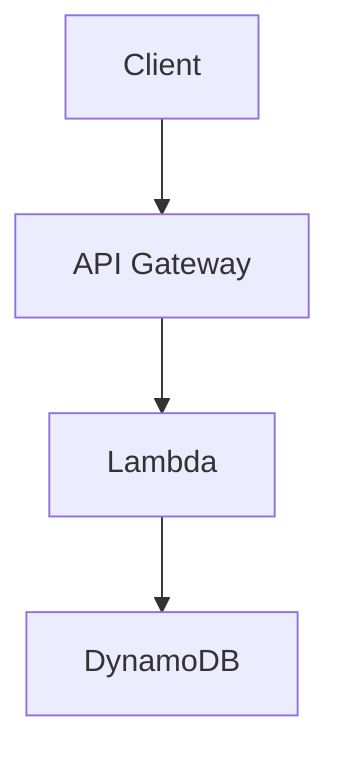

# Obsidian Cloud KMS Encryption

> 🇷🇺 [Документация на русском](README_RU.md)

[](https://snyk.io/test/github/ViktorUJ/obsidian-cloud-kms)

An [Obsidian](https://obsidian.md) plugin providing **transparent encryption** of secret blocks and binary files using AWS KMS.

## Table of Contents

- [Why](#why)
- [Key Principles](#key-principles)
- [How It Works](#how-it-works)
- [Commands](#commands)
- [Usage](#usage)
  - [Encrypting text in notes](#encrypting-text-in-notes)
  - [Nested code fences (mermaid, code)](#nested-code-fences-mermaid-code-etc)
  - [Encrypting binary files](#encrypting-binary-files)
  - [Removing encryption](#removing-encryption)
- [Behavior](#behavior)
- [Installation](#installation)
  - [Requirements](#requirements)
  - [From GitHub Releases](#from-github-releases)
  - [From source](#from-source)
  - [AWS Setup](#aws-setup)
- [Settings](#settings)
- [Security](SECURITY.md)
- [On-Disk Format](#on-disk-format)
- [Key Access Management](#key-access-management)
  - [User from the same AWS account](#user-from-the-same-aws-account)
  - [User from the same AWS Organization](#user-from-the-same-aws-organization-different-account)
  - [User from an external organization](#user-from-an-external-organization-external-aws-account)
- [Development](#development)
- [License](LICENSE)

## Why

If you store your Obsidian vault in S3, Git, or any other remote storage — note contents are accessible to anyone who gains access to that storage. This plugin implements a **Zero Trust Storage** model: only ciphertext exists on disk and in remote. Decryption happens locally, in memory, only when Cloud KMS access is available.

## Key Principles

- **Envelope Encryption** — each block/file is encrypted with a unique DEK (AES-256-GCM), and the DEK itself is wrapped by a CMK in cloud KMS
- **Identity-based Auth** — no passwords; uses system credentials (AWS SSO, IAM Role, `~/.aws/credentials`)
- **Local-First Crypto** — symmetric encryption runs locally via WebCrypto API; only the DEK goes to KMS for wrap/unwrap
- **Zero Cleartext on Disk** — decrypted content exists only in Obsidian process memory
- **Transparent** — encryption/decryption happens automatically on file read/write (monkey-patch vault adapter)
- **Nested Content** — `%%secret-start%%` / `%%secret-end%%` markers don't conflict with code fences, allowing nested ```mermaid, ```js and any other markdown

## How It Works

### Markdown files (secret blocks)

The plugin intercepts file reads and writes at the Obsidian vault adapter level:

- **On write to disk**: all blocks between `%%secret-start%%` and `%%secret-end%%` are automatically encrypted → stored on disk as ````ocke-v1
- **On read from disk**: all ````ocke-v1 blocks are automatically decrypted → shown in editor between `%%secret-start%%` / `%%secret-end%%`

### Binary files (PDF, images, audio)

- **"Encrypt current file"** command encrypts the file in place (name unchanged)
- On open — file is decrypted in memory (Blob URL), Obsidian displays it normally
- Disk always contains encrypted bytes in OCKE format
- Encrypted files are marked with 🔒 in the file explorer

## Commands

| Command | Description |
|---------|-------------|
| **Wrap selection in secret block** | Wraps selected text in `%%secret-start%%` / `%%secret-end%%` |
| **Unwrap secret block** | Removes encryption markers, leaving plaintext |
| **Encrypt current file with AWS KMS** | Encrypts a binary file (PDF, PNG, MP3) in place |
| **Decrypt current file with AWS KMS (permanent)** | Permanently decrypts a binary file (writes plaintext to disk) |

## Usage

### Encrypting text in notes

1. Select text in a note
2. `Ctrl+P` → **"Wrap selection in secret block"**
3. Text is wrapped in `%%secret-start%%` / `%%secret-end%%` markers
4. On save — automatically encrypted on disk

### Creating a secret block manually

Simply wrap text in markers:

```markdown
# My note

This is public text.

%%secret-start%%
This is secret content — will be encrypted on save.
Passwords, tokens, private notes — anything.
%%secret-end%%

This is public text again.
```

### Nested code fences (mermaid, code, etc.)

`%%` markers are Obsidian comments, invisible in Reading view. Content between them is regular markdown that renders normally:

```markdown
%%secret-start%%
# Secret Architecture



```bash
export SECRET_KEY="my-super-secret-key"
aws s3 cp secret.tar.gz s3://my-bucket/
```

Production password: `P@ssw0rd123!`
%%secret-end%%
```

After saving, the entire block (including mermaid diagram and code) is encrypted on disk. On open — decrypted, and mermaid renders as a diagram in Reading view.

### Encrypting binary files

1. Open a PDF, image, or other binary file
2. `Ctrl+P` → **"Encrypt current file with AWS KMS"**
3. File is encrypted in place (name unchanged, 🔒 appears in file explorer)
4. On next open — decrypted in memory, displayed normally

For **permanent** decryption (write plaintext back to disk):
- `Ctrl+P` → **"Decrypt current file with AWS KMS (permanent)"**

### Removing encryption

1. Select the entire block (from `%%secret-start%%` to `%%secret-end%%`)
2. `Ctrl+P` → **"Unwrap secret block"**
3. Markers are removed, text remains as regular markdown (no longer encrypted)

## Behavior

| Situation | Result |
|-----------|--------|
| Saving .md with `%%secret-start%%` blocks | Blocks encrypted → ````ocke-v1 on disk |
| Opening .md with ````ocke-v1 blocks (key available) | Decrypted → `%%secret-start%%...%%secret-end%%` in editor |
| Opening .md with ````ocke-v1 blocks (key NOT available) | Remain as ````ocke-v1 (encrypted base64) |
| Opening encrypted PDF/PNG (key available) | Decrypted in memory → displayed normally |
| Opening encrypted PDF/PNG (key NOT available) | Obsidian cannot render the file |
| KMS unavailable on save | File saved as-is, error shown |
| Each block/file | Encrypted independently (own DEK) |
| File explorer | Encrypted binary files marked with 🔒 |

## Installation

### Requirements

- Obsidian ≥ 1.4.0 (desktop)
- AWS credentials configured (`~/.aws/credentials` or `aws sso login`)

### From GitHub Releases

1. Go to [Releases](https://github.com/ViktorUJ/obsidian-cloud-kms/releases)
2. Download from the latest release: `main.js`, `manifest.json`
3. Create folder `.obsidian/plugins/obsidian-cloud-kms-encryption/` in your vault
4. Place downloaded files in that folder
5. Restart Obsidian → Settings → Community Plugins → enable "Cloud KMS Encryption"

### From source

```bash
git clone https://github.com/ViktorUJ/obsidian-cloud-kms.git
cd obsidian-cloud-kms
npm install
npm run build
```

Copy `main.js` and `manifest.json` to `.obsidian/plugins/obsidian-cloud-kms-encryption/`.

### AWS Setup

1. Create a KMS key:
   ```bash
   aws kms create-key --key-spec SYMMETRIC_DEFAULT --key-usage ENCRYPT_DECRYPT --region eu-north-1
   ```

2. Copy the key ARN (format: `arn:aws:kms:{region}:{account}:key/{key-id}`)

3. In Obsidian: Settings → Cloud KMS Encryption → paste the ARN

4. Verify credentials are available:
   ```bash
   aws sts get-caller-identity
   ```

> **Note**: region is extracted from the ARN automatically — no need to configure `AWS_REGION`.

## Settings

| Parameter | Description | Default |
|-----------|-------------|---------|
| AWS KMS Key ARN | Key ARN for encryption | — |
| Auto-decrypt blocks | Automatic decryption on read | ✅ |

## Security

Detailed threat model, cryptographic design, and limitations are described in [SECURITY.md](SECURITY.md).

Key points:

- Decrypted data is **never written to disk** — adapter patch encrypts before write
- Binary files are decrypted to Blob URL (RAM), not to disk
- DEK is zeroed immediately after use
- Each block/file uses a unique DEK + nonce
- AES-256-GCM with 96-bit nonce and 128-bit auth tag
- Encryption context bound to vault name + file path + format version
- All KMS calls are logged in AWS CloudTrail
- LRU cache of 20 decrypted binary files (old ones evicted from memory)
- No telemetry, no external calls except to AWS KMS
- Credentials are not stored by the plugin — standard AWS credential chain is used

## On-Disk Format

### Markdown (secret blocks)

On disk, secret blocks are stored as:

`````
````ocke-v1
<base64-encoded encrypted data>
````
`````

### Binary files

The file is entirely replaced with OCKE binary format:

```
[Magic: "OCKE" 4B][Version: uint16 BE][ProviderIdLen: 1B][ProviderId]
[CmkIdLen: uint16 BE][CmkId][WrappedDekLen: uint16 BE][WrappedDek]
[Nonce: 12B][AuthTag: 16B][CiphertextLen: uint32 BE][Ciphertext]
```

## Key Access Management

### User from the same AWS account

Add an IAM policy to the user/role:

```json
{
  "Version": "2012-10-17",
  "Statement": [
    {
      "Effect": "Allow",
      "Action": [
        "kms:Decrypt",
        "kms:GenerateDataKey",
        "kms:DescribeKey"
      ],
      "Resource": "arn:aws:kms:eu-north-1:790660747904:key/YOUR-KEY-ID"
    }
  ]
}
```

```bash
aws iam put-user-policy \
  --user-name colleague \
  --policy-name kms-vault-access \
  --policy-document file://policy.json
```

For read-only access (decryption only) — remove `kms:GenerateDataKey`.

### User from the same AWS Organization (different account)

**Step 1.** Update the Key Policy on the key owner's side — allow access from another account:

```json
{
  "Sid": "AllowCrossAccountDecrypt",
  "Effect": "Allow",
  "Principal": {
    "AWS": "arn:aws:iam::111122223333:root"
  },
  "Action": [
    "kms:Decrypt",
    "kms:GenerateDataKey",
    "kms:DescribeKey"
  ],
  "Resource": "*"
}
```

```bash
# Get current key policy
aws kms get-key-policy --key-id YOUR-KEY-ID --policy-name default --output text > key-policy.json

# Add the Statement above to key-policy.json, then:
aws kms put-key-policy --key-id YOUR-KEY-ID --policy-name default --policy file://key-policy.json
```

**Step 2.** On the other account's side (111122223333) — add IAM policy to the user:

```json
{
  "Version": "2012-10-17",
  "Statement": [
    {
      "Effect": "Allow",
      "Action": [
        "kms:Decrypt",
        "kms:GenerateDataKey",
        "kms:DescribeKey"
      ],
      "Resource": "arn:aws:kms:eu-north-1:790660747904:key/YOUR-KEY-ID"
    }
  ]
}
```

> Both conditions are required: Key Policy allows the account, IAM Policy allows the user.

### User from an external organization (external AWS account)

Similar to cross-account, but with additional restrictions via `Condition`:

**Step 1.** Key Policy — allow a specific user/role (not the entire account):

```json
{
  "Sid": "AllowExternalPartnerDecrypt",
  "Effect": "Allow",
  "Principal": {
    "AWS": "arn:aws:iam::444455556666:user/partner-user"
  },
  "Action": [
    "kms:Decrypt",
    "kms:DescribeKey"
  ],
  "Resource": "*",
  "Condition": {
    "StringEquals": {
      "kms:EncryptionContext:vaultName": "shared-vault"
    }
  }
}
```

> **Recommendations for external partners:**
> - Specify a concrete Principal (user/role ARN), not account `root`
> - Grant only `kms:Decrypt` (without `GenerateDataKey`) — read-only
> - Use `Condition` with `kms:EncryptionContext` to restrict access to a specific vault
> - Enable CloudTrail for auditing all key access

**Step 2.** Partner adds IAM policy on their side (same as cross-account above).

**Step 3.** Partner configures the plugin with the same key ARN and gains decryption access.

### Verifying access

```bash
# As the user who was granted access:
aws kms describe-key --key-id arn:aws:kms:eu-north-1:790660747904:key/YOUR-KEY-ID

# If it returns key metadata — access is granted
# If AccessDeniedException — check Key Policy + IAM Policy
```

## Development

```bash
npm test          # Run tests
npm run build     # Production build
npm run dev       # Dev build (watch)
make ci           # Full CI pipeline
```

## License

[MIT](LICENSE) © Viktar Mikalayeu
