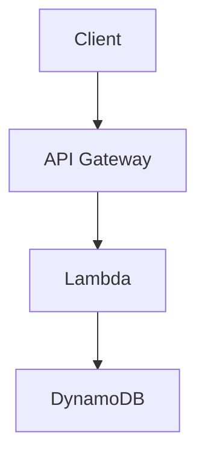

# Obsidian Cloud KMS Encryption

> 🇬🇧 [English documentation](README.md)

[](https://github.com/ViktorUJ/obsidian-cloud-kms/actions/workflows/ci.yml)
[](https://github.com/ViktorUJ/obsidian-cloud-kms/actions/workflows/codeql.yml)
[](https://scorecard.dev/viewer/?uri=github.com/ViktorUJ/obsidian-cloud-kms)
[](https://www.bestpractices.dev/projects/9999)
[](https://snyk.io/test/github/ViktorUJ/obsidian-cloud-kms)
[](https://slsa.dev)
[](LICENSE)

Плагин для [Obsidian](https://obsidian.md), обеспечивающий **прозрачное шифрование** секретных блоков и бинарных файлов с использованием AWS KMS.

## Оглавление

- [Зачем](#зачем)
- [Ключевые принципы](#ключевые-принципы)
- [Как работает](#как-работает)
- [Команды](#команды)
- [Использование](#использование)
  - [Шифрование текста в заметках](#шифрование-текста-в-заметках)
  - [Вложенные code fences (mermaid, code)](#вложенные-code-fences-mermaid-code-и-тд)
  - [Шифрование бинарных файлов](#шифрование-бинарных-файлов)
  - [Удаление шифрования текста](#удаление-шифрования-текста)
- [Поведение](#поведение)
- [Установка](#установка)
  - [Требования](#требования)
  - [Из GitHub Releases](#из-github-releases)
  - [Из исходников](#из-исходников)
  - [Настройка AWS](#настройка-aws)
- [Настройки](#настройки)
- [Безопасность](SECURITY.md)
- [Тестирование безопасности](SECURITY_TESTING.md)
- [Воспроизводимые сборки](REPRODUCIBLE_BUILDS.md)
- [Проверка целостности релизов](#проверка-целостности-релизов)
- [On-Disk Format](#on-disk-format)
- [Управление доступом к ключу](#управление-доступом-к-ключу)
  - [Мульти-ключевая архитектура](#мульти-ключевая-архитектура)
  - [Пользователь из того же AWS-аккаунта](#пользователь-из-того-же-aws-аккаунта)
  - [Пользователь из той же AWS Organization](#пользователь-из-той-же-aws-organization-другой-аккаунт)
  - [Пользователь из сторонней организации](#пользователь-из-сторонней-организации-внешний-aws-аккаунт)
- [CLI-расшифровка (без Obsidian)](#cli-расшифровка-без-obsidian)
  - [Ротация ключей / Миграция (ocke-rekey)](#ротация-ключей--миграция-ocke-rekey)
- [Сравнение с альтернативами](#сравнение-с-альтернативами)
- [Работа с Git](#работа-с-git)
- [Индикатор статуса KMS](#индикатор-статуса-kms)
- [Известные ограничения](#известные-ограничения)
- [Development](#development)
- [Лицензия](LICENSE)

## Зачем

Если вы храните Obsidian-хранилище в S3, Git или любом другом удалённом хранилище — содержимое заметок доступно любому, кто получит доступ к storage. Этот плагин реализует модель **Zero Trust Storage**: на диске и в remote всегда лежит только шифротекст. Расшифровка происходит локально, в памяти, только при наличии доступа к Cloud KMS.

## Ключевые принципы

- **Envelope Encryption** — каждый блок/файл шифруется уникальным DEK (AES-256-GCM), а сам DEK оборачивается CMK в облачном KMS
- **Identity-based Auth** — никаких паролей; используются системные credentials (AWS SSO, IAM Role, `~/.aws/credentials`)
- **Local-First Crypto** — симметричное шифрование выполняется локально через WebCrypto API; в KMS уходит только DEK для wrap/unwrap
- **Zero Cleartext on Disk** — расшифрованный контент существует только в оперативной памяти процесса Obsidian
- **Transparent** — шифрование/расшифровка происходит автоматически при чтении/записи файлов (monkey-patch vault adapter)
- **Nested Content** — маркеры `%%secret-start%%` / `%%secret-end%%` не конфликтуют с code fences, позволяя вкладывать ```mermaid, ```js и любой другой markdown

## Как работает

### Markdown-файлы (секретные блоки)

Плагин перехватывает чтение и запись файлов на уровне Obsidian vault adapter:

- **При записи на диск**: все блоки между `%%secret-start%%` и `%%secret-end%%` автоматически шифруются → на диске хранятся как `ocke-v1` блок
- **При чтении с диска**: все `ocke-v1` блоки автоматически расшифровываются → в редакторе показываются между `%%secret-start%%` / `%%secret-end%%`

### Бинарные файлы (PDF, изображения, аудио)

- Команда **"Encrypt current file"** шифрует файл на месте (имя не меняется)
- При открытии — файл расшифровывается в памяти (Blob URL), Obsidian показывает его как обычно
- На диске всегда зашифрованные байты в формате OCKE
- В file explorer зашифрованные файлы отмечены 🔒

## Команды

| Команда | Описание |
|---------|----------|
| **Wrap selection in secret block** | Оборачивает выделенный текст в `%%secret-start%%` / `%%secret-end%%` |
| **Unwrap secret block** | Убирает маркеры шифрования, оставляя plaintext |
| **Encrypt current file with AWS KMS** | Шифрует бинарный файл (PDF, PNG, MP3) на месте |
| **Decrypt current file with AWS KMS (permanent)** | Расшифровывает бинарный файл навсегда (записывает plaintext на диск) |

## Использование

### Шифрование текста в заметках

1. Выделите текст в заметке
2. `Ctrl+P` → **"Wrap selection in secret block"**
3. Текст оборачивается в `%%secret-start%%` / `%%secret-end%%` маркеры
4. При сохранении — автоматически шифруется на диске

### Ручное создание секретного блока

Просто оберните текст в маркеры:

```markdown
# Моя заметка

Это публичный текст.

%%secret-start%%
Это секретный контент — будет зашифрован при сохранении.
Пароли, токены, приватные заметки — всё что угодно.
%%secret-end%%

А это снова публичный текст.
```

### Вложенные code fences (mermaid, code и т.д.)

Маркеры `%%` — это Obsidian-комментарии, невидимые в Reading view. Содержимое между ними — обычный markdown, который рендерится нормально:

````markdown
%%secret-start%%
# Секретная архитектура



```bash
export SECRET_KEY="my-super-secret-key"
aws s3 cp secret.tar.gz s3://my-bucket/
```

Пароль от продакшена: `P@ssw0rd123!`
%%secret-end%%
````

После сохранения весь блок (включая mermaid-диаграмму и код) будет зашифрован на диске. При открытии — расшифрован, и mermaid отрендерится как диаграмма в Reading view.

### Шифрование бинарных файлов

1. Откройте PDF, изображение или другой бинарный файл
2. `Ctrl+P` → **"Encrypt current file with AWS KMS"**
3. Файл зашифрован на месте (имя не меняется, в file explorer появляется 🔒)
4. При следующем открытии — расшифровывается в памяти, отображается как обычно

Для **постоянной** расшифровки (записать plaintext обратно на диск):
- `Ctrl+P` → **"Decrypt current file with AWS KMS (permanent)"**

### Удаление шифрования текста

1. Выделите весь блок (от `%%secret-start%%` до `%%secret-end%%`)
2. `Ctrl+P` → **"Unwrap secret block"**
3. Маркеры убираются, текст остаётся как обычный markdown (больше не шифруется)

## Поведение

| Ситуация | Результат |
|----------|-----------|
| Сохранение .md с `%%secret-start%%` блоками | Блоки шифруются → на диске `ocke-v1` блок |
| Открытие .md с `ocke-v1` блоками (ключ доступен) | Расшифровываются → в редакторе `%%secret-start%%...%%secret-end%%` |
| Открытие .md с `ocke-v1` блоками (ключ НЕ доступен) | Остаются как `ocke-v1` (зашифрованный base64) |
| Открытие зашифрованного PDF/PNG (ключ доступен) | Расшифровывается в памяти → отображается нормально |
| Открытие зашифрованного PDF/PNG (ключ НЕ доступен) | Obsidian не может отрендерить файл |
| KMS недоступен при сохранении | Файл сохраняется как есть, ошибка показывается |
| Каждый блок/файл | Шифруется независимо (свой DEK) |
| File explorer | Зашифрованные бинарные файлы отмечены 🔒 |

## Установка

### Требования

- Obsidian ≥ 1.4.0 (desktop)
- AWS credentials настроены (`~/.aws/credentials` или `aws sso login`)

### Из GitHub Releases

1. Перейдите в [Releases](https://github.com/ViktorUJ/obsidian-cloud-kms/releases)
2. Скачайте из последнего релиза: `main.js`, `manifest.json`
3. Создайте папку `.obsidian/plugins/obsidian-cloud-kms-encryption/` в вашем хранилище
4. Положите скачанные файлы в эту папку
5. Перезапустите Obsidian → Settings → Community Plugins → включите "Cloud KMS Encryption"

### Из исходников

```bash
git clone https://github.com/ViktorUJ/obsidian-cloud-kms.git
cd obsidian-cloud-kms
npm install
npm run build
```

Скопируйте `main.js` и `manifest.json` в `.obsidian/plugins/obsidian-cloud-kms-encryption/`.

### Настройка AWS

1. Создайте KMS-ключ:
   ```bash
   aws kms create-key --key-spec SYMMETRIC_DEFAULT --key-usage ENCRYPT_DECRYPT --region eu-north-1
   ```

2. Скопируйте ARN ключа (формат: `arn:aws:kms:{region}:{account}:key/{key-id}`)

3. В Obsidian: Settings → Cloud KMS Encryption → вставьте ARN

4. Убедитесь, что credentials доступны:
   ```bash
   aws sts get-caller-identity
   ```

> **Примечание**: регион извлекается из ARN автоматически — не нужно настраивать `AWS_REGION`.

## Настройки

| Параметр | Описание | По умолчанию |
|----------|----------|--------------|
| AWS KMS Key ARN | ARN ключа для шифрования | — |
| Auto-decrypt blocks | Автоматическая расшифровка при чтении | ✅ |

## Безопасность

Подробный threat model, криптографический дизайн и ограничения описаны в [SECURITY.md](SECURITY.md).

Ключевые моменты:

- Расшифрованные данные **никогда не записываются на диск** — adapter patch шифрует перед записью
- Бинарные файлы расшифровываются в Blob URL (RAM), не на диск
- DEK обнуляется сразу после использования
- Каждый блок/файл использует уникальный DEK + nonce
- AES-256-GCM с 96-bit nonce и 128-bit auth tag
- Encryption context привязан к vault name + file path + format version
- Все KMS-вызовы логируются в AWS CloudTrail
- LRU-кеш на 20 расшифрованных бинарных файлов (старые вытесняются из памяти)
- Никакой телеметрии, никаких внешних вызовов кроме AWS KMS
- Credentials не хранятся в плагине — используется стандартная AWS credential chain

## Проверка целостности релизов

Каждый релиз криптографически подписан. Вы можете проверить что скачанные артефакты подлинные и не модифицированы:

### Проверка SLSA Provenance

```bash
# Установите GitHub CLI, затем:
gh attestation verify main.js --repo ViktorUJ/obsidian-cloud-kms
```

### Проверка подписи Cosign

```bash
# Установите cosign: https://docs.sigstore.dev/cosign/system_config/installation/
# Скачайте main.js и main.js.bundle из релиза, затем:
cosign verify-blob main.js \
  --bundle main.js.bundle \
  --certificate-identity-regexp "github.com/ViktorUJ/obsidian-cloud-kms" \
  --certificate-oidc-issuer "https://token.actions.githubusercontent.com"
```

Если проверка успешна — файл собран в GitHub Actions этого репозитория, не модифицирован после сборки.

### Проверка SBOM

Каждый релиз включает `sbom.spdx.json` — полный список всех зависимостей с версиями и лицензиями. Используйте для:
- Сканирования на известные уязвимости: `grype sbom.spdx.json`
- Проверки лицензий: `trivy sbom sbom.spdx.json`

## On-Disk Format

### Markdown (секретные блоки)

На диске секретные блоки хранятся как:

`````
````ocke-v1
<base64-encoded encrypted data>
````
`````

### Бинарные файлы

Файл целиком заменяется на OCKE бинарный формат:

```
[Magic: "OCKE" 4B][Version: uint16 BE][ProviderIdLen: 1B][ProviderId]
[CmkIdLen: uint16 BE][CmkId][WrappedDekLen: uint16 BE][WrappedDek]
[Nonce: 12B][AuthTag: 16B][CiphertextLen: uint32 BE][Ciphertext]
```

## Сравнение с альтернативами

| Возможность | Cloud KMS Encryption | SOPS | git-crypt | Meld Encrypt | HashiCorp Vault |
|-------------|---------------------|------|-----------|--------------|-----------------|
| Шифрование at rest | ✅ | ✅ | ✅ | ✅ | ✅ |
| Без паролей | ✅ (IAM) | ✅ (IAM/PGP) | ✅ (GPG) | ❌ (пароль) | ✅ (токены) |
| Гранулярность на уровне блока | ✅ | ✅ | ❌ (весь файл) | ✅ | N/A |
| Мульти-ключ / мульти-команда | ✅ | ✅ | ✅ | ❌ | ✅ |
| Git-safe (шифротекст в репо) | ✅ | ✅ | ✅ | ✅ | N/A |
| Прозрачное редактирование | ✅ | ❌ (CLI) | ✅ | ❌ (модальное окно) | N/A |
| Шифрование бинарных файлов | ✅ | ❌ | ✅ | ❌ | N/A |
| Интеграция с Obsidian | ✅ нативная | ❌ | ❌ | ✅ нативная | ❌ |
| Аудит (CloudTrail) | ✅ | ✅ | ❌ | ❌ | ✅ |
| Внешний аудит / сертификация | ❌ | ❌ | ❌ | ❌ | ✅ |
| HSM-уровень безопасности | ❌ | ❌ | ❌ | ❌ | ✅ |

**Лучшее применение:**
- **Cloud KMS Encryption** — командные базы знаний с IAM-контролем доступа, DevOps-секреты в Obsidian
- **SOPS** — секреты CI/CD в YAML/JSON, GitOps-воркфлоу
- **git-crypt** — шифрование целых файлов в Git-репозиториях
- **Meld Encrypt** — личные заметки с паролем, один пользователь
- **HashiCorp Vault** — секреты продакшен-инфраструктуры, compliance-требования

## Работа с Git

Плагин спроектирован для vault'ов, хранящихся в Git. На диске всегда только шифротекст — безопасно коммитить и пушить.

### Начальная настройка

```bash
# Клонируем vault
git clone git@github.com:your-org/team-vault.git
cd team-vault

# Открываем в Obsidian, настраиваем плагин (ARN ключа)
# Убеждаемся что AWS credentials доступны:
aws sts get-caller-identity
```

### Ежедневный workflow

```bash
# Подтягиваем изменения (на диске — шифротекст)
cd /path/to/vault
git pull

# Открываем Obsidian — плагин расшифровывает блоки прозрачно
# Редактируем заметки как обычно — секретные блоки показывают расшифрованный текст
# Закрываем Obsidian или переключаемся в терминал

# Коммитим и пушим (в Git уходит только шифротекст)
git add -A
git status          # проверяем: нет plaintext в diff
git commit -m "update finance Q3 notes"
git push
```

### Проверка что plaintext не утекает в Git

```bash
# Смотрим что реально лежит в файле на диске:
cat notes/budget.md
# Должны видеть: ocke-v1 блок с base64 — НЕ plaintext

# Проверяем diff перед коммитом:
git diff --cached
# Зашифрованные блоки показываются как base64-изменения, не читаемый текст

# Для бинарных файлов:
file attachments/report.pdf
# Должно показать: "data" (не "PDF document") — это зашифрованные байты
```

### Онбординг нового участника команды

```bash
# Новый участник:
# 1. Клонирует vault
git clone git@github.com:your-org/team-vault.git

# 2. Настраивает AWS credentials
aws configure
# или: aws sso login --profile team

# 3. Устанавливает плагин в Obsidian, указывает тот же ARN ключа
# 4. IAM-админ выдаёт kms:Decrypt на нужный ключ(и)

# 5. Открывает vault в Obsidian — блоки, к которым есть доступ, расшифровываются
#    Блоки без доступа остаются как зашифрованный base64
```

### Разрешение конфликтов

```bash
# Если Git показывает merge conflict в зашифрованном блоке:
# НЕ пытайтесь мержить base64 вручную — это бинарные данные

# Вариант 1: Принять их или нашу версию
git checkout --theirs notes/budget.md
# или
git checkout --ours notes/budget.md

# Вариант 2: Перешифровать после разрешения в Obsidian
# 1. Принять одну версию
# 2. Открыть в Obsidian, отредактировать расшифрованный контент
# 3. Сохранить — плагин перешифрует с новым DEK
# 4. Закоммитить
```

### Рекомендации для .gitignore

```gitignore
# Obsidian workspace (состояние открытых файлов, не секреты)
.obsidian/workspace.json
.obsidian/workspace-mobile.json

# Данные плагина (содержит ARN ключа — не секрет, но персональное)
.obsidian/plugins/obsidian-cloud-kms-encryption/data.json

# Никогда не игнорируйте эти файлы (это и есть зашифрованный vault):
# !*.md
# !attachments/
```

### Pre-commit hook: защита от утечки plaintext

Если плагин был выключен, credentials истекли, или файл редактировался вне Obsidian — маркеры `%%secret-start%%` могут оказаться на диске незашифрованными. Pre-commit hook предотвращает случайный коммит plaintext в Git:

```bash
# Установить hook
cp tools/pre-commit-hook.sh .git/hooks/pre-commit
chmod +x .git/hooks/pre-commit
```

Что делает:
- При каждом `git commit` проверяет все staged `.md` файлы
- Если в файле найден `%%secret-start%%` — **блокирует коммит**
- Показывает какой файл содержит незашифрованный контент и как исправить

Пример вывода при обнаружении plaintext:
```
ERROR: Plaintext secret block found in staged file: notes/budget.md
  The file contains %%secret-start%% markers which means
  the encryption plugin did not encrypt before save.

  Fix: Open the file in Obsidian with the plugin enabled,
  save it, then stage again.

Commit blocked: plaintext secrets detected.
```

> Это страховочная сетка — если всё работает правильно, `%%secret-start%%` никогда не должен появляться на диске (adapter patch шифрует его в `ocke-v1` блок перед записью). Hook ловит edge cases.

## CLI-расшифровка (без Obsidian)

Для disaster recovery, CI/CD пайплайнов или проверки бэкапов — можно расшифровать файлы без Obsidian через CLI.

> **Важно:** Encryption context (`vault-name` и `file-path`) должен совпадать с тем, что использовался при шифровании. Vault name — это имя папки вашего Obsidian vault. File path — путь относительно корня vault (например, `folder/note.md`).

### Вариант 1: Bash + AWS CLI + Python

Без Node.js. Требуется: `aws` CLI, `python3`, `pip install cryptography`.

```bash
# Расшифровать бинарный файл (PDF, изображение)
./tools/ocke-decrypt.sh report.pdf --vault-name my-vault --file-path report.pdf -o decrypted-report.pdf

# Расшифровать markdown-блоки (вывод в stdout)
./tools/ocke-decrypt.sh notes/secret.md --vault-name my-vault --file-path notes/secret.md

# Через переменные окружения
OCKE_VAULT_NAME="my-vault" OCKE_FILE_PATH="notes/secret.md" ./tools/ocke-decrypt.sh notes/secret.md -o decrypted.md
```

### Вариант 2: Node.js CLI

Требуется: Node.js >= 18, `@aws-sdk/client-kms`.

```bash
# Установить зависимости (один раз)
npm install @aws-sdk/client-kms @aws-sdk/credential-provider-ini

# Расшифровать бинарный файл
node tools/ocke-decrypt.mjs report.pdf --vault-name my-vault --file-path report.pdf -o decrypted-report.pdf

# Расшифровать markdown-блоки
node tools/ocke-decrypt.mjs notes/secret.md --vault-name my-vault --file-path notes/secret.md

# Через переменные окружения
OCKE_VAULT_NAME="my-vault" OCKE_FILE_PATH="notes/secret.md" node tools/ocke-decrypt.mjs notes/secret.md -o decrypted.md
```

### Параметры

| Параметр | Описание | Обязательный |
|----------|----------|--------------|
| `<file>` | Путь к зашифрованному файлу | Да |
| `-o <output>` | Записать результат в файл (по умолчанию: stdout) | Нет |
| `--vault-name` | Имя Obsidian vault (имя папки) | Да |
| `--file-path` | Путь файла относительно корня vault (как при шифровании) | Да |

Или через переменные окружения: `OCKE_VAULT_NAME`, `OCKE_FILE_PATH`.

> **Как узнать правильные значения:**
> - `vault-name` — имя папки vault (например, если vault в `/home/user/my-vault/`, имя — `my-vault`)
> - `file-path` — путь относительно корня vault (например, `notes/secret.md`, `attachments/report.pdf`)

### Когда использовать CLI

- **Disaster recovery** — Obsidian недоступен, нужен доступ к зашифрованным данным
- **CI/CD пайплайны** — расшифровка секретов при деплое без GUI
- **Проверка бэкапов** — убедиться что зашифрованные бэкапы валидны
- **Миграция** — массовая расшифровка при переходе с плагина

### Ротация ключей / Миграция (ocke-rekey)

Перешифровка всего vault новым KMS-ключом — для миграции на новый AWS-аккаунт, ротации ключей или смены региона. Перешифровывается только wrapped DEK (быстро), ciphertext не меняется.

```bash
# Установить зависимости
npm install @aws-sdk/client-kms @aws-sdk/credential-provider-ini

# Dry run — посмотреть что изменится
node tools/ocke-rekey.mjs /path/to/vault \
  --new-key arn:aws:kms:eu-west-1:NEW_ACCOUNT:key/new-key-id \
  --vault-name my-vault \
  --dry-run

# Выполнить миграцию
node tools/ocke-rekey.mjs /path/to/vault \
  --new-key arn:aws:kms:eu-west-1:NEW_ACCOUNT:key/new-key-id \
  --vault-name my-vault

# Мигрировать только блоки, зашифрованные конкретным старым ключом
node tools/ocke-rekey.mjs /path/to/vault \
  --new-key arn:aws:kms:eu-west-1:NEW_ACCOUNT:key/new-key-id \
  --old-key arn:aws:kms:eu-north-1:OLD_ACCOUNT:key/old-key-id \
  --vault-name my-vault
```

**Требования:**
- AWS credentials с `kms:Decrypt` на старом ключе И `kms:Encrypt` на новом
- Оба ключа должны быть доступны одновременно во время миграции
- После миграции обновите настройки плагина с новым ARN ключа

> **Примечание:** На Windows используйте Git Bash или WSL для корректной работы с Unicode-путями.
> Оба инструмента используют те же AWS credentials что и плагин (`~/.aws/credentials`).
> ARN ключа хранится внутри зашифрованных данных — конфигурация ключа не нужна.

## Индикатор статуса KMS

Плагин отображает индикатор состояния соединения в нижней панели Obsidian:

| Индикатор | Значение |
|-----------|----------|
| 🔓 KMS | Соединение OK — шифрование/расшифровка доступны |
| 🔒 KMS ⚠️ | KMS недоступен — секретные блоки НЕ будут зашифрованы при сохранении! |
| ⏳ KMS | Проверка соединения... |

**Поведение:**
- Проверяет доступность KMS при загрузке плагина
- Перепроверяет каждые 5 минут в фоне
- Клик по индикатору — ручная перепроверка
- При наведении — подробный tooltip

**Почему это важно:**
Если KMS недоступен (проблемы с сетью, истёкшие credentials, сбой AWS), плагин не может зашифровать `%%secret-start%%` блоки при сохранении. Файл будет сохранён с plaintext-маркерами. Индикатор статуса даёт мгновенную видимость этого риска — если видите 🔒 ⚠️, не сохраняйте файлы с секретными блоками до восстановления связи.

## Известные ограничения

### Monkey-patching Vault Adapter

Плагин перехватывает `vault.adapter.read()` и `vault.adapter.write()` для обеспечения прозрачного шифрования. Это тот же подход, что использует [gpgCrypt](https://github.com/tejado/obsidian-gpgCrypt) — единственный способ гарантировать zero-plaintext-on-disk без официального encryption API от Obsidian.

**Потенциальные конфликты с другими плагинами:**
- Если другой плагин тоже патчит `adapter.read()` или `adapter.write()`, два патча могут конфликтовать
- Плагин корректно вызывает оригинальный метод после обработки (chaining), но порядок инициализации имеет значение
- При проблемах попробуйте отключить другие плагины, модифицирующие файловый I/O

**Меры защиты:**
- Патч обрабатывает только `.md` файлы для текстового шифрования (бинарные проверяются по magic bytes)
- Файлы без маркеров `%%secret-start%%` или OCKE magic bytes проходят без изменений (нулевой overhead)
- При выгрузке плагина оригинальные методы adapter полностью восстанавливаются
- Патч прозрачен — другие плагины, работающие с незашифрованными файлами, не затрагиваются

**Если обновление Obsidian сломает плагин:**
- Ваши данные в безопасности — файлы остаются зашифрованными на диске в документированном формате OCKE
- Используйте [CLI-инструменты](#cli-расшифровка-без-obsidian) для расшифровки без Obsidian
- Плагин будет обновлён под новые internals Obsidian

## Development

```bash
npm test          # Запуск тестов
npm run build     # Production build
npm run dev       # Dev build (watch)
make ci           # Full CI pipeline
```

## Управление доступом к ключу

### Мульти-ключевая архитектура

В организациях разным командам нужен доступ к разным секретам. Плагин поддерживает несколько KMS-ключей, обеспечивая гранулярный контроль доступа:

**Кейс:** Общий vault компании, расшаренный между командами:
- **Финансовый отдел** — доступ к бюджетам, зарплатам, контрактам
- **R&D** — доступ к патентам, исследованиям, техническим секретам
- **CTO** — доступ ко всему (все ключи)

Каждый секретный блок шифруется конкретным ключом. IAM-политики на стороне AWS контролируют, кто может расшифровать что. Разработчик из R&D физически не может расшифровать финансовые данные — даже если у него есть доступ к файлам vault.

**Настройки плагина:**
```json
{
  "keys": [
    { "alias": "finance", "arn": "arn:aws:kms:eu-north-1:790660747904:key/aaa-111" },
    { "alias": "rnd", "arn": "arn:aws:kms:eu-north-1:790660747904:key/bbb-222" },
    { "alias": "cto", "arn": "arn:aws:kms:eu-north-1:790660747904:key/ccc-333" }
  ],
  "defaultKeyAlias": "finance"
}
```

**В заметках — указываем алиас ключа в маркере:**
```markdown
%%secret-start:finance%%
Бюджет Q3: $2.4M
Зарплаты: ...
%%secret-end%%

%%secret-start:rnd%%
Патент на новый алгоритм: ...
%%secret-end%%

%%secret-start:cto%%
Root credentials продакшена: ...
%%secret-end%%
```

**Поведение:**
- При шифровании: если настроено несколько ключей — появляется picker для выбора
- При расшифровке: ARN ключа записан внутри зашифрованных данных — плагин использует его автоматически
- Если у пользователя есть IAM-доступ к ключу → блок расшифровывается
- Если нет → блок остаётся зашифрованным (graceful degradation)
- В одной заметке могут быть блоки, зашифрованные разными ключами

**Настройка IAM на стороне AWS:**
- Финансовый отдел → IAM-политика разрешает только `kms:Decrypt` на `key/aaa-111`
- R&D → IAM-политика разрешает только `kms:Decrypt` на `key/bbb-222`
- CTO → IAM-политика разрешает `kms:Decrypt` на все три ключа

### Пользователь из того же AWS-аккаунта

Добавьте IAM-политику пользователю/роли:

```json
{
  "Version": "2012-10-17",
  "Statement": [
    {
      "Effect": "Allow",
      "Action": [
        "kms:Decrypt",
        "kms:GenerateDataKey",
        "kms:DescribeKey"
      ],
      "Resource": "arn:aws:kms:eu-north-1:790660747904:key/YOUR-KEY-ID"
    }
  ]
}
```

```bash
aws iam put-user-policy \
  --user-name colleague \
  --policy-name kms-vault-access \
  --policy-document file://policy.json
```

Для read-only доступа (только расшифровка) — уберите `kms:GenerateDataKey`.

### Пользователь из той же AWS Organization (другой аккаунт)

**Шаг 1.** Обновите Key Policy на стороне владельца ключа — разрешите доступ из другого аккаунта:

```json
{
  "Sid": "AllowCrossAccountDecrypt",
  "Effect": "Allow",
  "Principal": {
    "AWS": "arn:aws:iam::111122223333:root"
  },
  "Action": [
    "kms:Decrypt",
    "kms:GenerateDataKey",
    "kms:DescribeKey"
  ],
  "Resource": "*"
}
```

```bash
# Получить текущую политику ключа
aws kms get-key-policy --key-id YOUR-KEY-ID --policy-name default --output text > key-policy.json

# Добавить Statement выше в key-policy.json, затем:
aws kms put-key-policy --key-id YOUR-KEY-ID --policy-name default --policy file://key-policy.json
```

**Шаг 2.** На стороне другого аккаунта (111122223333) — добавьте IAM-политику пользователю:

```json
{
  "Version": "2012-10-17",
  "Statement": [
    {
      "Effect": "Allow",
      "Action": [
        "kms:Decrypt",
        "kms:GenerateDataKey",
        "kms:DescribeKey"
      ],
      "Resource": "arn:aws:kms:eu-north-1:790660747904:key/YOUR-KEY-ID"
    }
  ]
}
```

> Оба условия обязательны: Key Policy разрешает аккаунт, IAM Policy разрешает пользователя.

### Пользователь из сторонней организации (внешний AWS-аккаунт)

Аналогично cross-account, но с дополнительными ограничениями через `Condition`:

**Шаг 1.** Key Policy — разрешите конкретного пользователя/роль (не весь аккаунт):

```json
{
  "Sid": "AllowExternalPartnerDecrypt",
  "Effect": "Allow",
  "Principal": {
    "AWS": "arn:aws:iam::444455556666:user/partner-user"
  },
  "Action": [
    "kms:Decrypt",
    "kms:DescribeKey"
  ],
  "Resource": "*",
  "Condition": {
    "StringEquals": {
      "kms:EncryptionContext:vaultName": "shared-vault"
    }
  }
}
```

> **Рекомендации для внешних партнёров:**
> - Указывайте конкретный Principal (user/role ARN), не `root` аккаунта
> - Давайте только `kms:Decrypt` (без `GenerateDataKey`) — только чтение
> - Используйте `Condition` с `kms:EncryptionContext` для ограничения доступа к конкретному vault
> - Включите CloudTrail для аудита всех обращений к ключу

**Шаг 2.** Партнёр добавляет IAM-политику на своей стороне (как в cross-account выше).

**Шаг 3.** Партнёр настраивает плагин с тем же ARN ключа и получает доступ к расшифровке.

### Проверка доступа

```bash
# От имени пользователя, которому дали доступ:
aws kms describe-key --key-id arn:aws:kms:eu-north-1:790660747904:key/YOUR-KEY-ID

# Если вернёт метаданные ключа — доступ есть
# Если AccessDeniedException — проверьте Key Policy + IAM Policy
```

## Лицензия

[MIT](LICENSE) © Viktar Mikalayeu
